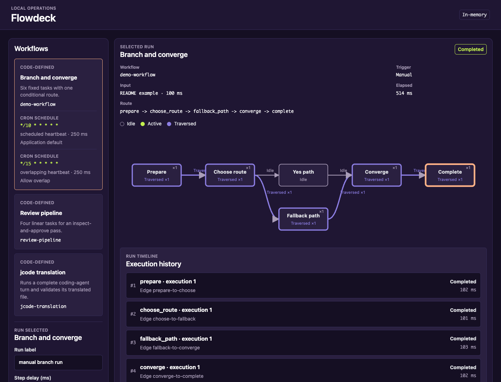

# Flowdeck

A local workflow cockpit for running, scheduling, and inspecting code-defined graph-flow workflows. Flowdeck keeps bounded execution history in memory, renders node and edge traces, and can use jcode as an optional coding-agent node.

## Usage



Start Flowdeck through one of the setup options, then open <http://127.0.0.1:3000/>. Choose one of the bundled sample workflows, enter its run arguments, and select **Run workflow**. The completed run appears with its traversed route and chronological execution history; select a node or edge with a pointer, Enter, or Space to inspect retained state, timing, output, and errors. The bundled workflows demonstrate the interface only; users define the workflows their applications require.

Each run remains addressable at `/workflows/{workflow_id}/runs/{run_id}` while the server process is alive. Run-history filters are preserved in the URL, so reloads, bookmarks, and browser navigation restore the same server-rendered view without cookies.

## Key features

- A Rust workflow registry with bundled samples that demonstrate graph execution and optional coding-agent integration without prescribing user workflows.

- Workflow-owned forms whose data is deserialized by Serde, validated by garde, and applied as the initial graph-flow context.

- Code-defined cron schedules with skip-while-running and allow-overlap policies.

- Process-wide concurrency, terminal-run retention, and workflow execution limits that bound in-memory and runtime work.

- Automatically laid out SVG topology with external self-loop routing and active, traversed, selected, and execution-count states.

- Per-execution node and edge traces with timestamps, elapsed time, state, output, errors, and exact `StepId` history.

- Optional coding-agent integration, with jcode as one example, using one lazily started shared process and isolated or reusable named sessions.

- URL-addressable server-rendered run-history filtering with current-state SSE updates.

## All Code

Flowdeck follows an **All Code** approach: runtime configuration, schedules, and workflows are defined explicitly in Rust. It deliberately provides no low-code or no-code workflow layer, visual workflow editor, or external configuration format as an alternative source of truth.

With modern AI-assisted development, low-code and no-code representations offer no meaningful advantage in either version control or implementation cost. Flowdeck keeps Rust as its sole source of truth to maximize extensibility, compiler-checked correctness, and runtime performance.

## Prerequisites

- **Nix**: Install Nix with flakes enabled on `aarch64-darwin`, `aarch64-linux`, or `x86_64-linux` to run or install the packaged application.

- **jcode**: Optional; required only when a user-defined workflow uses the bundled jcode coding-agent integration, together with its provider credentials.

## Setup

### Run without installing

```bash
nix run github:totto2727-org/flowdeck
```

### Install

```bash
nix profile add github:totto2727-org/flowdeck
```

### Nix flake

```nix
{
  inputs.flowdeck.url = "github:totto2727-org/flowdeck";

  outputs = { flowdeck, ... }: {
    packages = flowdeck.packages;
  };
}
```

## API

This local application does not publish a stable external Rust API.

See [Flowdeck Architecture](./docs/architecture.md).
## Development

For repository structure and development commands, see [AGENTS.md](./AGENTS.md).

## License

MIT

_This README was generated from the [share-artifact skill](https://raw.githubusercontent.com/totto2727-org/agent/refs/heads/main/plugins/totto2727-coding/skills/share-artifact/SKILL.md) and [README template](https://raw.githubusercontent.com/totto2727-org/agent/refs/heads/main/plugins/totto2727-coding/skills/share-artifact/readme/template.md)._
