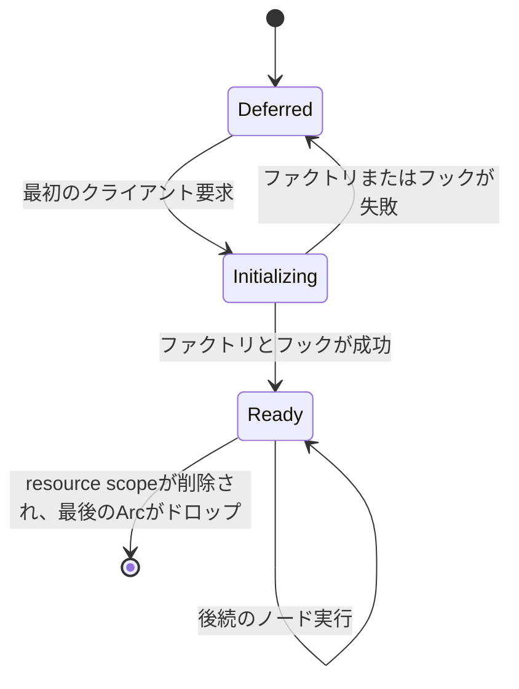
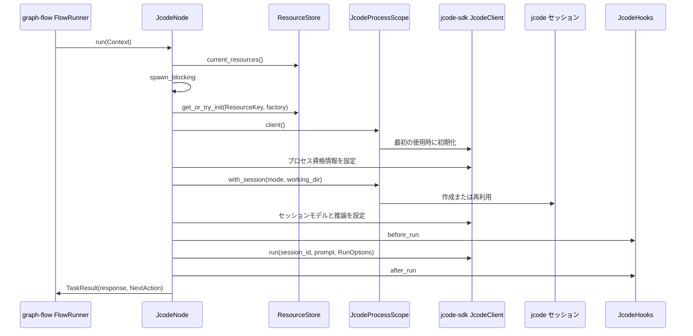

# graph-flow-jcode アーキテクチャ

## 1. 役割

`graph-flow-jcode` は、高レベルな jcode コーディングエージェントのターン1回分を実行する、再利用可能な graph-flow の `Task` を提供します。
graph-flow のルーティングと、`jcode-sdk` のプロセス、クライアント、セッション、プロンプト、オプション、フック、結果 API を組み合わせます。

このクレートはノードテンプレートであり、ワークフローエンジンやアプリケーションのシングルトンではありません。
呼び出し側が、型付きの`ResourceKey`とruntime factory、どのノードがそのkeyを共有するか、セッションのキー付け方法、graph実行を囲むexecution scopeの`ResourceStore`を決定します。

## 2. 非目標

このクレートは以下を行いません:

- アプリケーションのワークフローレジストリを所有する;
- 呼び出し側が明示的にイーガーコンストラクタを使用しない限り、アプリケーションのブートストラップ中に jcode を起動する;
- すべてのアプリケーションに対して jcode プロセスを1つだけ規定する;
- graph-flow の実行履歴、スケジューリング、HTTP、または UI を管理する;
- jcode から独立してワークスペースのスキルや MCP 設定を発見する;
- テストや例のためにプロジェクトレベルの `.jcode` 設定を書き込む;
- `JcodeOutput` に資格情報を保持する。

ワークスペースのスキルと MCP の読み込みは、jcode SDK/プロセスの動作のままです。
ノードは、適切な起動、セッション、ターンの境界でサポートされている SDK 設定を透過的に渡します。

## 3. 主要な型

```text
JcodeProcessScope
├── 遅延クライアントファクトリ
├── OnceLock<JcodeProcess>
├── 初期化 Mutex
└── JcodeProcess
    ├── JcodeClient
    └── 名前付きセッションレジストリ

JcodeNode
├── ResourceKey
├── JcodeProcessScope factory
├── プロンプトファクトリ
├── セッションオプションファクトリ
├── セッションモードファクトリ
├── 実行オプションファクトリ
├── ターンフック
└── graph-flow NextAction
```

execution scopeの`ResourceStore`が、公開された`JcodeProcessScope`値を所有します。
初期化後の`JcodeProcessScope`は、provider process、client、名前付きsessionを所有します。
`JcodeNode` は1つのグラフタスク実行のポリシーを所有します。

## 4. プロセススコープのライフサイクル

### 4.1 遅延構築

`JcodeProcessScope::deferred` は、クライアントファクトリを呼び出さずに保存します。
`deferred_launch` と `deferred_launch_with_hooks` は起動指向のヘルパーです。
最初のnode実行は`spawn_blocking`の前に現在のstoreを解決し、blocking thread上でkeyに対応する`JcodeProcessScope`を初期化または取得してから、scopeが1つの`JcodeProcess`を初期化します。



初期化はミューテックスと `OnceLock` を使用します:

1. ロックフリーの準備完了パスを読み取ります。
2. 競合する初期化試行を直列化します。
3. ミューテックス取得後に再確認します。
4. ファクトリを呼び出します。
5. 完全に初期化されたプロセスのみを公開します。

失敗した試行は `OnceLock` に保存されません。
次のノード実行が初期化を再試行します。
したがって、同時の最初の実行では、失敗後の再試行を維持しながら、最大1つの成功したプロセスが公開されます。

### 4.2 イーガー構築

`launch` と `launch_with_hooks` は、起動時のプロセス検証を意図的に望むスタンドアロンプログラムのために引き続き利用可能です。
`from_client` は、すでに接続されている SDK クライアントをラップし、決定的なテストおよび埋め込みのシームです。

### 4.3 シャットダウン

スコープは内部プロセスを通じて `JcodeClient` を所有します。
最後の所有スコープをドロップするとクライアントがドロップされ、`jcode-sdk` がプライベートに起動したプロセスをシャットダウンできるようになります。
このクレートは、アプリケーションのシグナルハンドリングやグローバルなシャットダウンフックをインストールしません。

## 5. ノード実行



jcode SDK は同期です。
`JcodeNode::run` は、ブロッキングターン全体を `tokio::task::spawn_blocking` に移動し、非同期の graph-flow エグゼキュータをブロックしないようにします。
Tokioのtask-local stateはblocking closure内で利用できないため、nodeはblocking境界を越える前に現在のresource storeを解決してcloneします。
ジョインの失敗と `JcodeNodeError` の値は、タスク境界で `GraphError::TaskExecutionFailed` になります。

## 6. セッションポリシー

`SessionMode` は会話の所有権を選択します:

- `New` は、そのノード実行に対して個別の jcode セッションを作成します。
- `Reuse(SessionKey)` は、最初の使用時に1つの名前付きセッションを作成し、同じプロセススコープ内の後続のノードまたは実行でそれを再利用します。

`SessionKey` は空白の値を拒否します。
このクレートは、ワークフローやアプリケーションの識別子からキーを導出しません。
グラフを所有する統合コードが、`with_session_mode` を通じてキーを提供します。

名前付きセッションは、初期の作業ディレクトリを保持します。
異なる作業ディレクトリで同じキーを再利用することは、ターン前に拒否されます。
管理対象の各セッションにはターンミューテックスがあるため、2つのタスクが1つの会話でターンを交互に行うことはできません。
異なるセッションキーは、プロセスとクライアントを共有しながら、個別の会話を維持します。

一般的なコーディングワークフローのポリシーは次のとおりです:

```text
一般的なワークフロー実行 ID -> SessionMode::Reuse
同じ実行                -> 同じ jcode 会話
異なる実行              -> 異なる jcode 会話
分離されたノード        -> SessionMode::New
```

これは統合ポリシーであり、クレート全体のデフォルトではありません。

## 7. 設定の透過

設定は、`jcode-sdk` がそれを受け入れる境界で適用されます。

| 境界 | クレート API | 例 |
| --- | --- | --- |
| プロセス起動 | `JcodeProcessScope` ファクトリまたは `deferred_launch_with_hooks` | バイナリ、作業ディレクトリ、環境、ログイン、起動タイムアウト、リクエストタイムアウト |
| プロセス初期化 | `JcodeProcessHooks` | 起動オプションの変更、接続済みクライアントの初期化 |
| セッション実行 | `with_session_options` | 作業ディレクトリ、プロバイダー資格情報、モデル、推論努力 |
| ターン実行 | `with_run_options` | 正確な SDK の `RunOptions`、画像、イベントコールバック |
| プロンプトと検証 | `JcodeHooks` | ファイルの読み取り、プロンプトの拡充、結果の検証または正規化 |
| グラフルーティング | `with_next_action` | 続行、終了、または別の graph-flow アクション |

ファクトリは現在の graph-flow の `Context` を受け取り、ワークフロー所有の設定が検証済みの実行入力を基づいて決定できるようにします。そのポリシーをアプリケーションコアに移すことなく実現します。

プロバイダー資格情報は、セッション作成前に SDK クライアントに送信されます。
`ProviderCredential` は、`Debug` 出力から API キーを秘匿します。
このクレートは、GlossShift や他のプロバイダー設定形式を自身で読み取りません。

## 8. フック

`JcodeProcessHooks` は、プロセス起動試行の前後に実行されます:

- `before_launch` は `LaunchOptions` を変更できます;
- `after_launch` は接続済みクライアントを初期化できます。

遅延初期化では、これらのフックは起動試行ごとに1回実行され、成功して公開されたプロセスに対して正確に1回実行されます。

`JcodeHooks` は、すべてのエージェントターンの前後に実行されます:

- `before_run` は、コンテキストを検査し、ライブのクライアント/セッションを使用し、プロンプトを変更し、または `RunOptions` を変更できます;
- `after_run` は、ファイルを検査し、結果を検証し、グラフコンテキストを更新し、または返されたテキストを正規化できます。

フックエラーはそのノード実行を停止し、安定したフェーズに帰属します。

## 9. 出力とグラフコンテキスト

成功した実行は、ユーザープロンプトとアシスタントテキストを graph-flow のチャット履歴に追加します。
`JcodeOutput` を `JCODE_OUTPUT_KEY` の下に保存し、出力テキストを graph-flow のタスク応答として返します。

`JcodeOutput` には、SDK 結果によって提供されるセッション ID、テキスト、ツール呼び出し、使用量、終了理由が含まれます。
プロバイダーの API キーや完全なクライアント設定は含まれません。

アプリケーションは、オペレーターに見えるトレース状態に必要なフィールドのみを射影する必要があります。
完全な graph-flow コンテキストをショートカットとしてシリアライズすべきではありません。

## 10. エラー

`JcodeNodeError` は以下を区別します:

- 無効なノード設定;
- ライフサイクルフックの拒否;
- graph-flow コンテキスト更新の失敗;
- execution scopeのresourceがないこと;
- jcode SDK のプロセス、セッション、またはターンの失敗;
- ブロッキングタスクのジョイン失敗。

遅延プロセスエラーは、最初に jcode を必要とするノード実行中に発生します。
別のアプリケーション起動エラータイプは必要ありません。

## 11. テスト

統合契約は、プロセス内の Unix ソケットによる偽の jcode プロトコルピアを使用します。
以下を検証します:

- 資格情報、セッション、モデル、推論、プロンプトに対する正確な SDK リクエスト順序;
- ターン前/後のフック順序;
- グラフコンテキストの出力とチャット履歴;
- 名前付きセッションの再利用と新規セッションの分離;
- 最初のノード実行前のクライアント作成がないこと;
- 複数のノードで共有される1つの成功した初期化;
- 最初のresource初期化失敗後の再試行;
- resource scope外でnodeを実行した場合の型付き失敗。

テストは `.jcode`、MCP、またはスキルファイルを作成しません。発見と読み込みは SDK/プロセスの責任であるためです。

## 12. 例

`examples/jcode_translation.rs` は、1つの `JcodeNode` を持つ完全な graph-flow グラフを構築します。
オペレーティングシステムの一時ワークスペースにソースファイルと出力ファイルを作成し、設定されたバイナリを起動し、グラフを実行し、生成された翻訳を読み取ります。

この例は、永続的なリポジトリワークスペースやプロジェクトの `.jcode` ディレクトリを作成しません。
リポジトリの `Justfile` は、ピン留めされた jcode バイナリを `.tools/jcode/bin/jcode` にインストールし、例はそのパスを `JCODE_BIN` を通じて受け取ります。

## 13. スコープ選択のガイダンス

ノードが意図的に1つの jcode プロセスを共有し、会話を再利用する可能性がある場合は、1つの共有スコープを使用します。
プロセス環境、認証境界、ライフタイム、または障害分離が異なる必要がある場合は、別々のスコープを使用します。
プロセス分離が明示的に必要な場合を除き、ノード実行ごとに新しいプロセススコープを作成しないでください。
