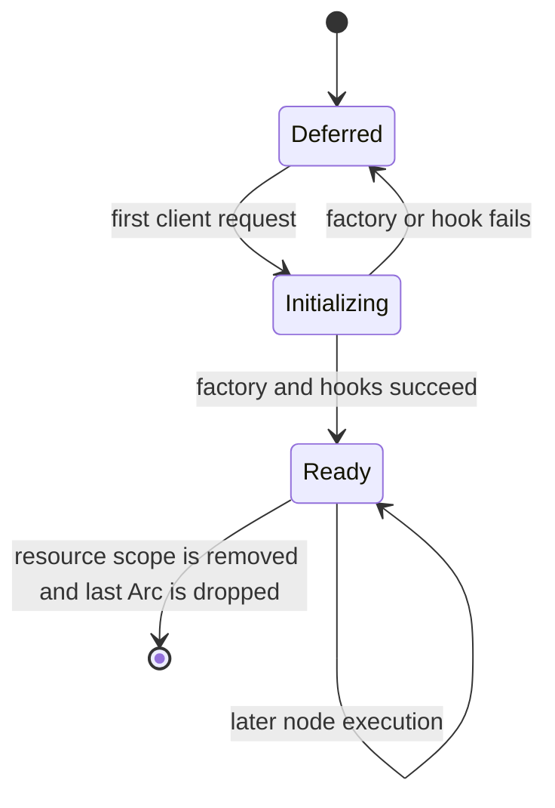
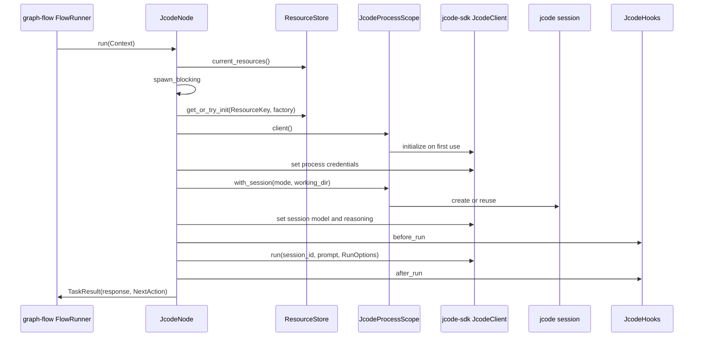

# graph-flow-jcode architecture

## 1. Role

`graph-flow-jcode` provides a reusable graph-flow `Task` that runs one complete high-level jcode coding-agent turn.
It combines graph-flow routing with `jcode-sdk` process, client, session, prompt, option, hook, and result APIs.

The crate is a node template, not a workflow engine or an application singleton.
Callers provide a typed `ResourceKey` and runtime factory, decide which nodes share that key, define how sessions are keyed, and establish the execution-scoped `ResourceStore` around graph execution.

## 2. Non-goals

The crate does not:

- own an application workflow registry;
- start jcode during application bootstrap unless the caller explicitly uses an eager constructor;
- prescribe exactly one jcode process for every application;
- manage graph-flow run history, scheduling, HTTP, or UI;
- discover workspace skills or MCP configuration independently of jcode;
- write project-level `.jcode` configuration for tests or examples;
- retain credentials in `JcodeOutput`.

Workspace skill and MCP loading remain jcode SDK/process behavior.
The node passes supported SDK settings through at the appropriate launch, session, and turn boundaries.

## 3. Main types

```text
JcodeProcessScope
├── deferred client factory
├── OnceLock<JcodeProcess>
├── initialization Mutex
└── JcodeProcess
    ├── JcodeClient
    └── named session registry

JcodeNode
├── ResourceKey
├── JcodeProcessScope factory
├── prompt factory
├── session option factory
├── session mode factory
├── run option factory
├── turn hooks
└── graph-flow NextAction
```

The execution-scoped `ResourceStore` owns the published `JcodeProcessScope` value.
`JcodeProcessScope` owns the provider process, client, and named sessions after initialization.
`JcodeNode` owns the policy for one graph task execution.

## 4. Process scope lifecycle

### 4.1 Deferred construction

`JcodeProcessScope::deferred` stores a client factory without invoking it.
`deferred_launch` and `deferred_launch_with_hooks` are launch-oriented helpers.
The first node execution resolves the current store before `spawn_blocking`, initializes or obtains the keyed `JcodeProcessScope` on the blocking thread, then the scope initializes one `JcodeProcess`.



Initialization uses a mutex plus `OnceLock`:

1. Read the lock-free ready path.
2. Serialize competing initialization attempts.
3. Recheck after acquiring the mutex.
4. Invoke the factory.
5. Publish only a fully initialized process.

A failed attempt is not stored in `OnceLock`.
The next node execution retries initialization.
Concurrent first executions therefore publish at most one successful process while preserving retry after failure.

### 4.2 Eager construction

`launch` and `launch_with_hooks` remain available for standalone programs that deliberately want startup-time process validation.
`from_client` wraps an already connected SDK client and is the deterministic test and embedding seam.

### 4.3 Shutdown

The scope owns the `JcodeClient` through the internal process.
Dropping the last owning scope drops the client, allowing `jcode-sdk` to shut down its privately launched process.
The crate does not install application signal handling or a global shutdown hook.

## 5. Node execution



The jcode SDK is synchronous.
`JcodeNode::run` moves the complete blocking turn into `tokio::task::spawn_blocking` so it does not block the async graph-flow executor.
The node resolves and clones the current resource store before crossing that blocking boundary because Tokio task-local state is not available inside the blocking closure.
Join failures and `JcodeNodeError` values become `GraphError::TaskExecutionFailed` at the task boundary.

## 6. Session policy

`SessionMode` selects conversation ownership:

- `New` creates a distinct jcode session for that node execution.
- `Reuse(SessionKey)` creates one named session on first use and reuses it for later nodes or executions in the same process scope.

`SessionKey` rejects blank values.
The crate does not derive keys from workflow or application identifiers.
The graph-owning integration supplies the key through `with_session_mode`.

Named sessions retain their initial working directory.
Reusing the same key with a different working directory is rejected before the turn.
Each managed session has a turn mutex, so two tasks cannot interleave turns in one conversation.
Different session keys share the process and client while retaining separate conversations.

A common coding-workflow policy is:

```text
generic workflow run ID -> SessionMode::Reuse
same run                -> same jcode conversation
different run           -> different jcode conversation
isolated node           -> SessionMode::New
```

This is an integration policy, not a crate-wide default.

## 7. Configuration pass-through

Configuration is applied at the boundary where `jcode-sdk` accepts it.

| Boundary | Crate API | Examples |
| --- | --- | --- |
| Process launch | `JcodeProcessScope` factory or `deferred_launch_with_hooks` | binary, working directory, environment, logins, startup timeout, request timeout |
| Process initialization | `JcodeProcessHooks` | mutate launch options, initialize connected client |
| Session execution | `with_session_options` | working directory, provider credentials, model, reasoning effort |
| Turn execution | `with_run_options` | exact SDK `RunOptions`, images, event callback |
| Prompt and validation | `JcodeHooks` | read files, enrich prompt, validate or normalize result |
| Graph routing | `with_next_action` | continue, end, or another graph-flow action |

Factories receive the current graph-flow `Context`, allowing workflow-owned configuration to depend on validated run input without moving that policy into the application core.

Provider credentials are sent to the SDK client before session creation.
`ProviderCredential` redacts API keys from `Debug` output.
The crate does not read GlossShift or another provider configuration format itself.

## 8. Hooks

`JcodeProcessHooks` runs around a process launch attempt:

- `before_launch` may mutate `LaunchOptions`;
- `after_launch` may initialize the connected client.

With deferred initialization, these hooks run once for each launch attempt and exactly once for the successful published process.

`JcodeHooks` runs around every agent turn:

- `before_run` may inspect context, use the live client/session, mutate the prompt, or mutate `RunOptions`;
- `after_run` may inspect files, validate the result, update graph context, or normalize the returned text.

Hook errors stop that node execution and are attributed to their stable phase.

## 9. Output and graph context

Successful execution adds the user prompt and assistant text to graph-flow chat history.
It stores `JcodeOutput` under `JCODE_OUTPUT_KEY` and returns the output text as the graph-flow task response.

`JcodeOutput` contains the session ID, text, tool calls, usage, and finish reason supplied by the SDK result.
It does not contain provider API keys or the complete client configuration.

Applications should project only the fields required for operator-visible trace state.
They should not serialize the complete graph-flow context as a shortcut.

## 10. Errors

`JcodeNodeError` distinguishes:

- invalid node configuration;
- lifecycle hook rejection;
- graph-flow context update failure;
- missing execution-scoped resources;
- jcode SDK process, session, or turn failure;
- blocking-task join failure.

Deferred process errors occur during the node execution that first requires jcode.
They do not need a separate application startup error type.

## 11. Tests

The integration contract uses an in-process Unix-socket fake jcode protocol peer.
It verifies:

- exact SDK request order for credentials, session, model, reasoning, and prompt;
- before/after turn hook ordering;
- graph context output and chat history;
- named-session reuse and new-session isolation;
- no client creation before the first node execution;
- one successful initialization shared by multiple nodes;
- retry after the first resource initialization failure;
- typed failure when a node runs outside a resource scope.

The tests do not create `.jcode`, MCP, or skill files because discovery and loading are SDK/process responsibilities.

## 12. Example

`examples/jcode_translation.rs` builds a complete graph-flow graph with one `JcodeNode`.
It creates source and output files in an operating-system temporary workspace, launches the configured binary, executes the graph, and reads the generated translation.

The example does not create a persistent repository workspace or project `.jcode` directory.
The repository `Justfile` installs the pinned jcode binary under `.tools/jcode/bin/jcode`, and the example receives that path through `JCODE_BIN`.

## 13. Scope selection guidance

Use one shared scope when nodes intentionally share one jcode process and may reuse conversations.
Use separate scopes when process environment, authentication boundary, lifetime, or failure isolation must differ.
Do not create a new process scope per node execution unless process isolation is explicitly required.
