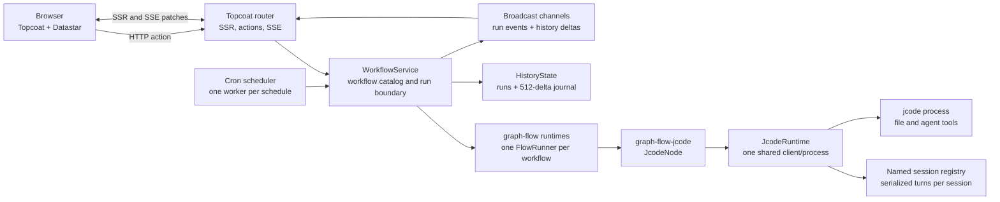
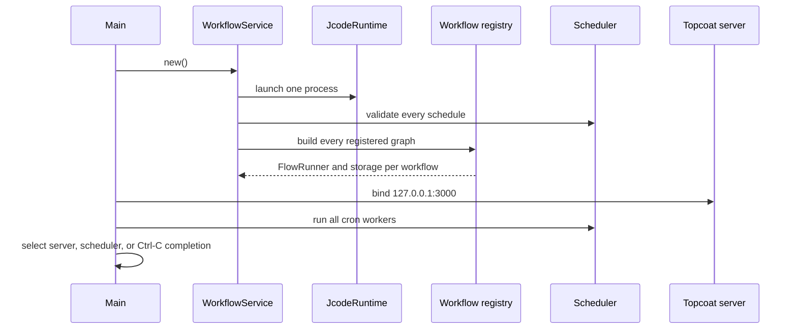
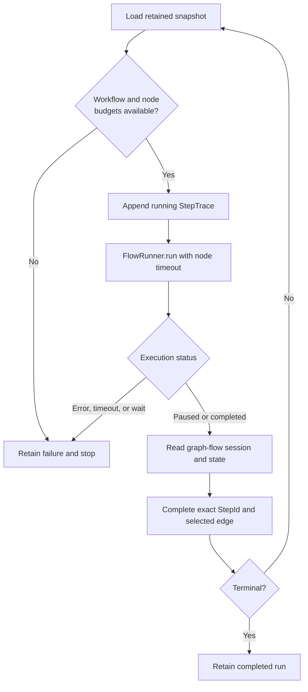

# ワークフローコンソールアーキテクチャ

このドキュメントは、Workflow Console Experimentの現在のランタイムアーキテクチャについて説明します。
これは、ワークフロー、エージェントノード、スケジュール、実行ポリシー、または代替グラフレンダラーを追加するメンテナにとってのソース指向のリファレンスです。

[English](./architecture.md)

## 1. 目的と境界

Workflow Consoleは、コード定義ワークフローのためのローカル専用オーケストレーション基盤です。
決定論的なワークフロー進行を担うgraph-flowと、ファイル操作やエージェントツールを備えたコーディングエージェント実行を担うjcodeを組み合わせています。

このアプリケーションは、以下の関心事を意図的にプロセスローカルに保っています:

- ワークフロー定義とグラフランナー。
- 単一のjcodeプロセスとそのセッションレジストリ。
- 実行スナップショット、ステップトレース、および履歴リビジョン。
- Cronワーカーとオーバーラップ所有権。
- サーバーレンダリングHTMLとSSEによるブラウザ同期。

現在のアーキテクチャには、ワークフローデザイナー、データベース、分散スケジューラ、外部キュー、またはマルチプロセス調整プロトコルは含まれていません。

## 2. システム概要

主要なアーキテクチャ境界は`WorkflowService`です。
手動アクション、cron発火、ページレンダリング、実行固有のSSE、および履歴SSEはすべて同じサービスインスタンスを使用します。

## 3. プロセスライフサイクル

`src/main.rs`がアプリケーションの起動とシャットダウンを所有します。

`WorkflowService::new`は、HTTPサーバーが起動する前にjcodeを起動します。
jcodeバイナリ、GlossShift互換性設定、スケジュール定義、実行制限、またはグラフ定義が無効な場合、起動は失敗します。
ライブエージェントプロセスを必要としないテストは`WorkflowService::without_jcode_runtime`を使用し、jcodeワークフローに対して利用不可能なエージェントタスクを受け取ります。

Topcoatサーバーとスケジューラは、`tokio::select!`の下で同じTokioプロセス内で実行されます。
予期しないスケジューラまたはサーバーの終了は、部分的に機能するコンソールを残す代わりにアプリケーションを終了させます。

## 4. ワークスペースとクレート境界

| 境界 | 責任 |
| --- | --- |
| `crates/graph-flow-jcode` | 汎用graph-flowタスク、共有jcodeプロセス所有権、名前付きセッション、SDKオプションファクトリ、ライフサイクルフック、および構造化出力。 |
| `src/workflows` | アプリケーションワークフローレジストリ、フォーム、入力解析、グラフ構築、スケジュール、およびワークフロー固有の統合。 |
| `src/workflow.rs` | 実行開始境界、graph-flowランタイムカタログ、共有インメモリ状態、サブスクリプション、およびスケジュール所有権。 |
| `src/workflow/driver.rs` | 一度に一ステップずつ進める制限付き実行と、graph-flow結果の保持トレースへの変換。 |
| `src/workflow_scheduler.rs` | Cron検証、スケジュールごとの1ワーカー、オーバーラップポリシー、およびスケジュールされたディスパッチ。 |
| `src/features` | ワークフローランチャー、選択実行インスペクタ、履歴パネル、SSEトランスポート、およびパッチフラグメント。 |
| `src/app` | 正規ルート、初期SSR、Datastarシグナル、ナビゲーション、およびフィーチャー構成。 |
| `src/features/run_detail/component/topology` | 交換可能なトポロジーレイアウトとレンダリング契約、および現在のSVG実装。 |

ルートパッケージは、ワークスペースパスを通じて`graph-flow-jcode`に依存します。
`graph-flow-jcode`は、`https://github.com/1jehuang/jcode`の固定Gitリビジョンから直接`jcode-sdk`に依存します。

## 5. ワークフロー定義と登録

各ワークフローは、`src/workflows`の下に垂直スライスを所有します。
完全なワークフローは次の契約を提供します:

1. 安定した`WORKFLOW_ID`。
2. 開始ノード、不変のノードおよびエッジメタデータ、およびオプションの制限オーバーライドを含む`WorkflowDefinition`。
3. サーバーレンダリングされた入力フォーム。
4. 初期ページシグナルのデフォルト入力値。
5. 正規化された`RunInput`を返すSerdeおよびgarde入力解析。
6. タスクおよび遷移IDが保持されたメタデータと一致するgraph-flowグラフ。
7. オプションのスケジュール入力解決。

`src/workflows.rs`は中央レジストリであり、現在3つのワークフローを含んでいます:

| ワークフロー | 形状 | 目的 |
| --- | --- | --- |
| `demo-workflow` | 条件分岐と収束を持つ6つのノード | 分岐、cronスケジューリング、オーバーラップポリシー、および観測可能な模擬タスクを検証します。 |
| `review-pipeline` | 4つの線形ノード | 単純な検査と承認のパスを検証します。 |
| `jcode-translation` | 1つのエージェントノード | ソースファイルを読み取り、jcodeに翻訳を依頼し、ターゲットを書き込み、結果を検証します。 |

レジストリは、フォームレンダリング、デフォルト、入力解析、グラフ構築、およびスケジュール入力を網羅的なワークフローIDマッチングを通じてルーティングします。
HTTPおよび実行境界がワークフローを初期化する方法を知らないため、`WorkflowDefinition`のみを追加するだけでは不十分です。
プロジェクトローカルの`workflow-console-add-workflow`スキルには、実装チェックリストが含まれています。

## 6. 実行作成とgraph-flowコンテキスト

手動実行とcron実行の両方が`WorkflowService::start`を通じて入ります。
境界は、実行を保持する前にワークフローIDを検証し、ワークフロー所有の入力を解析します。

各実行は以下を受け取ります:

- UUIDベースの不透明な`RunId`。
- 定義の`start_node`から始まるgraph-flow`Session`。
- グラフIDとしてのワークフローID。
- `Running`ステータスと初期ルートサマリーを持つ`RunSnapshot`。

graph-flowコンテキストは、ワークフロータスクとトレースプロジェクションが共有する安定したキーを使用します:

| コンテキストキー | 値 | 目的 |
| --- | --- | --- |
| `workflow_input` | 正規化されたワークフロー所有のJSON | 初期タスク入力と保持された状態プロジェクション。 |
| `input_summary` | 短い表示文字列 | 模擬タスクと履歴のための人間が読める入力サマリー。 |
| `jcode_session_key` | 現在の`RunId` | 同じ実行内のすべてのエージェントノードで1つのjcodeセッションを再利用します。 |
| `jcode_output` | `JcodeOutput` | 直列化されたエージェント本文、reasoning、ツール呼び出し出力、使用量、およびセッションIDを保持します。 |

`RunId`をjcodeセッションキーとして使用すると、各ワークフロー実行に分離されたエージェント会話が与えられ、その実行内のすべてのjcodeノードが以前の分析とファイル操作コンテキストを共有できます。
別のセッション共有ポリシーは、`JcodeNode`に別の`SessionMode`ファクトリを供給することで実装できます。

## 7. 制限付き実行ドライバー

サービスは、ワークフロー定義ごとに1つの`FlowRunner`と1つの`InMemorySessionStorage`を作成します。
runを開始すると、graph-flowセッションを保存し、初期スナップショットを保持し、`RunStarted`を発行し、ドライバーを起動します。

ドライバーは、一度に1つの観測可能なグラフステップを実行します:

すべてのノード実行は、1から始まるrun内の`StepId`と、そのノードIDの1から始まる実行回数を受け取ります。
したがって、繰り返される自己ループ実行は、以前のノード状態を上書きする代わりに独立したトレースを追加します。
ドライバーは正確な`StepId`を完了または失敗させるため、非同期UI更新が同じノードの2つの実行を混同することはありません。

ドライバーは、現在および次のgraph-flowタスクIDから選択された`EdgeSpec`を導出します。
保持されたルート、トラバーサルカウント、現在のノード、現在のエッジ、トレース出力、および投影された状態は、ライフサイクルおよび履歴イベントが発行される前にアトミックに更新されます。

## 8. 実行制限

`WorkflowDefinition::limits`はアプリケーションのデフォルトをオーバーライドできます。
`None`のままにすると、ワークフローのノード数から厳密な制限が導出されます。

| スコープ | デフォルト | 強制ポイント |
| --- | --- | --- |
| ワークフロー合計ステップ | `node_count * 5` | すべてのノード実行の前にチェックされます。 |
| ワークフロー合計タイムアウト | `max_steps * 5 minutes` | 完全なドライバーの周りのTokioタイムアウト。 |
| ノードIDごとの実行回数 | `5` | 現在のノードを実行する前にチェックされます。 |
| ノード実行ごとのタイムアウト | `5 minutes` | 1つの`FlowRunner::run`の周りのTokioタイムアウト。 |

すべての設定されたカウントと期間は非ゼロでなければならず、導出された算術はオーバーフローしてはなりません。
制限違反は、アクティブなステップが存在する場合、保持された失敗した実行および失敗したステップトレースになります。

エッジトラバーサルカウントは表示されますが、エッジ固有のカウントおよびタイムアウトの強制は実装されていません。
これは、暗黙の安全性の保証ではなく、明示的な現在の制限です。

## 9. 汎用jcodeノードアーキテクチャ

### 9.1 1つのプロセス、複数のセッション

`JcodeRuntime`は正確に1つの`jcode_sdk::JcodeClient`を所有し、そのクライアントは1つの起動されたjcodeプロセスを所有します。
ランタイムは`Arc`でラップされ、登録されたすべてのエージェントノードに渡されます。

`SessionMode`はセッション動作を選択します:

- `New`はノード実行のために別個のSDKセッションを作成します。
- `Reuse(SessionKey)`は最初の使用時にセッションを作成し、その後同じプロセスローカルセッションを返します。

ランタイムは、異なる作業ディレクトリでの1つのキーの再利用を拒否します。
各管理セッションにはターンミューテックスがあるため、セッションを共有する同時ノードはプロンプトをインターリーブしたり、同時に同じ会話を変更したりすることはできません。
異なるセッションは、jcodeプロセスおよびSDKの動作に従って、共有クライアントを同時に使用できます。

### 9.2 設定可能なSDK境界

`JcodeNode`は、ワークフロー固有のポリシーを埋め込む代わりに、ファクトリとフックを受け入れます:

| 境界 | 設定インターフェイス |
| --- | --- |
| プロセス起動 | 完全なSDK `LaunchOptions`、さらに`before_launch`および`after_launch`ランタイムフック。 |
| セッション選択 | graph-flow `Context`を使用する`SessionMode`ファクトリ。 |
| セッション設定 | 作業ディレクトリ、プロバイダー資格情報、モデル、および推論強度のための`SessionOptions`。 |
| プロンプト | 現在のgraph-flowコンテキストを使用するプロンプトファクトリ。 |
| ターン実行 | 完全なSDK `RunOptions`ファクトリ、可変の`before_run`フック、および可変の`after_run`結果フック。 |
| グラフ継続 | 設定可能なgraph-flow `NextAction`。 |

SDKクライアントは、単一のノードに属さないプロセス全体の初期化のために`JcodeRuntime::client`によって公開されます。
クレートは`jcode_sdk`を再エクスポートするため、コンシューマは別の依存関係バージョンを追加せずに正確なSDKタイプを使用できます。

`JcodeNode::run`は、高レベルSDK呼び出しがブロッキングであるため、`tokio::task::spawn_blocking`を使用します。
ノードは資格情報とセッションモデルオプションを設定し、フックを実行し、プロンプトを送信し、graph-flow会話メッセージを記録し、`JcodeOutput`をコンテキストに保存します。

### 9.3 アプリケーション翻訳ワークフロー

現在の`jcode-translation`ワークフローは単一の`translate_files`ノードを使用し、1つの完全なコーディングエージェントターンの後に終了します。
そのフックは制約付き翻訳プロンプトを構築し、jcodeが要求された相対ファイルを読み書きできるようにし、実行後にターゲットを検証します。

ワークフローは、GlossShiftの選択されたプロバイダー設定をXDG設定ディレクトリから読み取り、それをjcodeの組み込み`opencode-go`互換性環境にマッピングします。
このアダプターは意図的に`src/workflows/jcode_translation/glossshift.rs`に分離されています。
将来のファーストクラスのプロバイダープロファイルおよび資格情報処理は、アプリケーション固有のGlossShift知識で汎用ノードクレートを拡張せずに、そのアダプターを置き換える必要があります。

資格情報値は起動環境またはSDK呼び出しに注入され、`RunSnapshot`または`StepState`へ直接コピーされません。
`ProviderCredential`は`Debug`出力でAPIキーを秘匿します。
`JcodeOutput`はエージェント本文、プロバイダーのreasoning、およびツール出力を汎用的な秘匿化なしで保持するため、workflow hookは機密出力がtrace stateになる前に拒否または正規化する必要があります。

### 9.4 バイナリとサンプルの分離

`just install-jcode`は、固定されたjcodeバイナリを`.tools/jcode`の下にインストールします。
`JCODE_BIN`はバイナリパスをオーバーライドでき、アプリケーションはそれ以外の場合、パッケージルートから`.tools/jcode/bin/jcode`を解決します。
`.tools`およびすべての`target`ディレクトリはGitによって無視されます。

`graph-flow-jcode`サンプルは、オペレーティングシステムの一時ワークスペースに入力と出力を作成します。
リポジトリ内に`.jcode`、MCP、スキル、または翻訳フィクスチャディレクトリを作成しません。

## 10. スケジューラーアーキテクチャ

スケジュールは、コードで登録された不変の`ScheduleSpec`値です。
各仕様には、安定したID、ワークフローID、秒を含む6フィールドのcron式、入力サマリー、およびオーバーラップポリシーが含まれます。

起動検証は以下を拒否します:

- 重複するスケジュールID。
- 不明なワークフローID。
- 不明または無効なスケジュール入力。
- 無効なcron式。
- 空のスケジュールレジストリ。

`run_scheduler`はすべてのスケジュールを解析し、式ごとに1つの構造化Tokioワーカーを`JoinSet`内にスパウンします。
各ワーカーは次のUTC発生時刻を計算し、その瞬間までスリープし、手動アクションと同じ`WorkflowService::start`境界を通じてディスパッチします。

デフォルトの`SkipWhileRunning`ポリシーは、runを開始する前にスケジュールIDをアトミックに占有します。
同じスケジュールが以前の実行がアクティブな間に発火した場合、サービスは`Skipped`スナップショットを保持し、発火を静かにドロップする代わりに`RunSkipped`を発行します。
占有状態は、runが完了、失敗、または開始できないときに解放されます。

`AllowOverlap`はスケジュール所有権をバイパスし、すべての発火を開始します。
ポリシーは`ScheduleSpec`からのみ選択されます。スケジューラーはワークフローの動作やファイルアクセスから推論しません。

## 11. 保持された実行、トレース、およびイベント状態

`RunSnapshot`は、1つの実行の完全なオペレーター向け状態です。
ID、ワークフローと入力、トリガー、ライフサイクルステータス、現在のトポロジー位置、トラバースされたルート、タイムスタンプ、および順序付けられたステップトレースが含まれます。

実行ライフサイクル状態は次のとおりです:

- `Running`。
- `Completed`。
- 保持されたメッセージを持つ`Failed`。
- 保持された理由を持つ`Skipped`。

`StepTrace`は以下を保持します:

- 安定した`StepId`、run内シーケンス、ノードID、およびノードごとの実行番号。
- 実行中、完了、または失敗のステータス。
- ノードが遷移を選択したときに選択されたエッジ。
- 実行後に投影された状態。
- 出力または失敗テキスト。
- 開始、終了、および期間の値。

2つのブロードキャストチャネルが異なるコンシューマにサービスを提供します:

| チャネル | ペイロード | 主要コンシューマ |
| --- | --- | --- |
| ワークフローイベント | `RunStarted`、`NodeStarted`、`NodeCompleted`、`RunCompleted`、`RunFailed`、`RunSkipped` | 選択実行SSEおよび統合オブザーバー。 |
| 履歴イベント | リビジョン付き`HistoryDelta` | フィルタリングされた実行履歴SSE。 |

履歴は、サーバーの存続期間中、すべての実行スナップショットをプロセスメモリに保持します。
そのリプレイジャーナルは、リストメンバーシップに必要なフィールドのみを含む512の軽量デルタに独立して制限されています。
これにより、完全なステップトレースをすべてのリプレイエントリにクローンすることなく、正確なフィルター遷移をサポートできます。

## 12. HTTP、SSR、およびSSE境界

| ルート | 責任 |
| --- | --- |
| `GET /` | デフォルトワークフローの最新の実行または正規の実行なしルートにリダイレクトします。 |
| `GET /workflows/{workflow_id}` | そのワークフローの最新の実行または正規の実行なしルートにリダイレクトします。 |
| `GET /workflows/{workflow_id}/runs/` | 保持された実行がない場合にワークフロートポロジーをレンダリングします。 |
| `GET /workflows/{workflow_id}/runs/{run_id}` | 1つの正確な保持された実行とその履歴パネルをレンダリングします。 |
| `POST /actions/runs` | Datastarシグナルを解析し、手動実行を開始し、その正確なURLにナビゲートします。 |
| `GET /events/runs/{run_id}` | 一致するワークフローイベントの後に選択された実行インスペクタをパッチします。 |
| `GET /events/history` | リビジョン付きフィルタリングされた履歴行デルタをリプレイおよびストリームします。 |

SSRは、初期ドキュメント、正規URL、ワークフローフォームのデフォルト、選択された実行、履歴フィルター、および初期Datastarシグナルを所有します。
Datastarは小さなクライアント側の選択シグナルを所有し、サーバーレンダリングされたパッチを適用します。アプリケーション固有のJavaScript状態ストアはありません。

選択実行SSEはライフサイクルイベントをサブスクライブし、その実行IDの実行インスペクタのみを再レンダリングします。
履歴SSEは`HistoryDelta`をサブスクライブし、正規化されたワークフロー、トリガー、およびステータスフィルターを適用し、挿入、置換、削除、または空状態パッチを発行します。

ブラウザは再接続時に`after`クエリカーソルとSSE `Last-Event-ID`の両方を提供します。
サーバーは最大の有効なカーソルを使用し、連続した保持されたデルタをリプレイし、重複を無視し、リビジョンギャップ、レシーバー遅延、または古いカーソルが信頼できるパッチングを妨げる場合にページをリロードします。
リロードパスは、アトミックなSSR `HistoryView`から状態を再確立します。

## 13. トポロジーと実行履歴の表示

トポロジーデータは`WorkflowDefinition`から取得され、ワークフローIDジオメトリテーブルからは決して取得されません。

`TopologyLayoutEngine`は交換可能なレイアウト境界を定義します。
現在の`LayeredAutoLayout`:

- 自己エッジを除外しながら、入次数とランクを計算します。
- 宣言順にノードを決定論的なランク行に割り当てます。
- 未処理の非自己サイクルを`(0,0)`で重ねる代わりにフォールバックランクに配置します。
- 前方エッジを三次曲線でルーティングします。
- 自己エッジをノードの上に外部ループとしてルーティングします。
- 後方エッジをレーンオフセット付きでグラフの上にルーティングします。
- 配置されたノードからSVG `viewBox`を計算します。

`TopologyRenderer`は交換可能なレンダリング境界を定義します。
現在の`SvgTopologyRenderer`は、アクティブ、トラバース、選択、および実行回数の状態を持つアクセシブルなSVGノードおよびエッジコントロールをレンダリングします。
将来のMermaidまたはライブラリベースのレンダラーは、ワークフロー実行や保持された状態を変更せずに同じモデルを実装できます。

トポロジーは、読み取り可能な最小幅より下で水平スクロールを所有します。
ページ自体はレイアウトメカニズムとして水平スクロールを使用することはありません。

runインスペクタは、2つの関連するナビゲーション操作面を提供します:

- グラフはノードまたはエッジを選択し、その最新の保持された実行を追跡します。
- 実行履歴リストは、時系列順に正確な`StepId`を選択します。

各トレースパネルには、同じノードまたはエッジへの繰り返し訪問のための実行セレクタと、`Follow latest`コントロールが含まれます。
状態および出力ブロックは、長いシリアル化された値やCJK出力を含むすべてのテキストを内部オーバーフロー付きで保持します。

## 14. 失敗と回復の動作

アーキテクチャは、最も近い観測可能な境界で失敗を保持します:

- 無効なHTTP入力は、実行を作成せずにリクエストメッセージを返します。
- グラフ構築、スケジュール検証、jcode起動、および無効な実行制限設定は起動を失敗させます。
- ノードエラーとノードタイムアウトは、アクティブな`StepId`と実行を失敗させます。
- ワークフロータイムアウトまたは合計ステップの枯渇は実行を失敗させます。
- 欠落したgraph-flowセッションまたはトレース状態は、完了を偽造する代わりに実行を失敗させます。
- デフォルトポリシーの下での同じスケジュールのオーバーラップは、表示可能なスキップされた実行を作成します。
- SSEギャップまたは遅延は、権威のあるインメモリ状態からの完全なページリロードを引き起こします。

アプリケーション終了後のプロセス回復または永続化はありません。
サーバーを再起動すると、新しいjcodeプロセスが開始され、名前付きセッションがクリアされ、実行履歴がクリアされ、履歴リビジョンがリセットされ、cronワーカーが再起動されます。

## 15. 拡張ポイントと不変条件

### ワークフローを追加する

プロジェクトローカルの`workflow-console-add-workflow`スキルを使用し、1つの垂直スライスですべてのレジストリ境界を更新します。
タスクID、`NodeSpec`、`EdgeSpec`、グラフ遷移、およびトレース期待値を同一に保ちます。

### 複数のエージェントノードを追加する

ノードが1つのコーディングタスクに属する場合、同じ実行所有の`JCODE_SESSION_KEY`を`SessionMode::Reuse`に渡します。
ノードが分離を必要とする場合は、`SessionMode::New`または別の安定したキーを使用します。
ノードまたは実行ごとに別の`JcodeRuntime`を作成しないでください。

### グラフレンダリングを置き換える

`TopologyRenderer`を実装し、適切な場合は対応する`TopologyLayoutEngine`を実装します。
ワークフローIDと`StepId`に基づいて実行IDを維持します。レンダラーローカルの要素IDがワークフロー状態モデルになってはなりません。

### 永続化またはデプロイトポロジーを変更する

永続化とマルチプロセススケジューリングをアーキテクチャ移行として扱います。
現在の`RwLock`、ブロードキャストチャネル、名前付きjcodeセッション、スケジュール占有、および履歴リビジョンジャーナルは1つのプロセスを想定しており、runストレージのvectorのみを交換しても分散化できません。

### 必要な不変条件

- アプリケーション起動中に正確に1つのjcodeランタイムが作成されます。
- ワークフロー実行は1つのgraph-flowセッションと1つの安定したjcodeセッションキーを所有します。
- すべてのノード実行は別個の`StepId`を追加します。
- ワークフローおよびノード制限は独立して検証および強制されます。
- すべてのスケジュールには一意のIDと明示的なオーバーラップポリシーがあります。
- スキップされたスケジュール発火は履歴に表示されたままです。
- トポロジーレイアウトは定義から導出され、不明なIDで`(0,0)`にフォールバックすることはありません。
- 選択実行SSEと履歴SSEストリームは分離されたままです。
- 設定上の資格情報は、保持されたトレースまたは履歴状態へ直接コピーされません。

## 16. 現在のトレードオフ

- 実行履歴とjcodeセッションは再起動時に失われます。
- 実行ベクターは、リプレイジャーナルが制限されているにもかかわらず、無制限です。
- Cron所有権はプロセスローカルであり、複数のレプリカを調整しません。
- 失敗したスケジュールワーカーはスケジューラーを終了させ、したがってアプリケーションを終了させます。
- エッジ固有のカウントおよびタイムアウト制限は強制されません。
- 自動レイアウトは決定論的ですが、専用のグラフレイアウトライブラリよりも意図的に単純です。
- GlossShiftプロバイダーマッピングは一時的な互換性アダプターです。
- エージェント本文、reasoning、およびツール出力は汎用的なsecret秘匿化なしで保持されます。
- 汎用jcodeクレートは最も重要な起動、セッション、プロンプト、実行、およびフック境界を公開しますが、将来のSDK追加には明示的な転送APIが必要になる場合があります。

これらのトレードオフは現在のローカル実験には許容可能であり、永続化、リモートデプロイ、または大規模なワークフローグラフが導入される前に再検討すべき最初の境界です。
