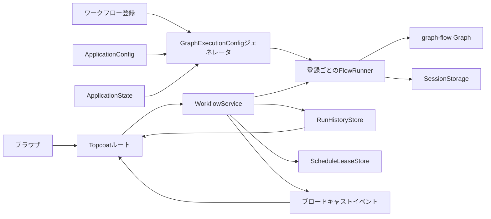
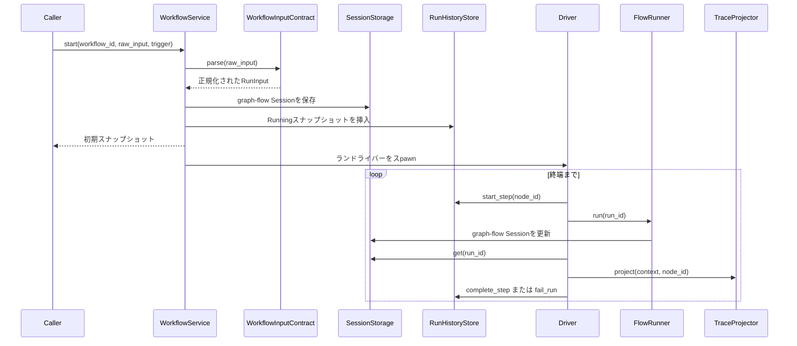

# SQLite storage update

The storage and startup sections in this historical translation describe the pre-SQLite implementation.
See the current [English architecture](./architecture.md) and [SQLite design](./plans/sqlite-storage.md) for the authoritative database, migration, validation, and recovery contracts.

# ワークフローコンソールのアーキテクチャ

## 1. 適用範囲

ワークフローコンソールは、コード定義のグラフフロー型ワークフローの登録、実行、スケジュール、および検査を行うローカルTopcoatアプリケーションです。
アプリケーションコアは、エージェントバックエンドを選択したり、グラフタスクの実装を解釈したりしません。
その責務は、通常のワークフロー登録を汎用のグラフフロー実行構成に変換し、観測可能な実行状態を保持し、その状態をHTTP、HTML、およびSSEを通じて公開することです。

このアーキテクチャは、次の4つの所有規則に従います。

1. ワークフロー登録は、その実行可能なグラフ、入力契約、トレース射影、および静的プレゼンテーションメタデータを所有します。
2. アプリケーション構成は、プロセス全体の運用ポリシーを所有し、ワークフローまたはノードの動作を所有しません。
3. アプリケーション状態は、一貫したバックエンドバンドルとして注入されます。
4. オプションのノード統合は、アプリケーション境界を越える前に、自身のリソースを捕捉します。

## 2. システム概要



`WorkflowService`は、登録と汎用アプリケーションポリシーのみを受け取ります。
グラフトポロジ、グラフタスクタイプ、または具体的なエージェント実装によって分岐することはありません。
すべての登録は、同じ`WorkflowRegistration -> GraphExecutionConfig -> FlowRunner`パスに従います。

## 3. 起動

`src/main.rs`の実行可能ブートストラップは、以下の操作を実行します。

1. `ApplicationConfig::local_default()`を構築します。
2. 構成を`WorkflowService::with_config`に渡します。
3. コード定義の登録カタログを構築します。
4. 一貫した`ApplicationState`バックエンドバンドルを1つ構築します。
5. すべての登録に対して1つの`GraphExecutionConfig`を生成します。
6. 各`FlowRunner`を同じ汎用パスを通じて構築します。
7. コンパイル済みTopcoatアセットバンドルを読み込みます。
8. 構成されたソケットアドレスにバインドします。
9. HTTPサーバー、構成されたスケジューラ、およびシャットダウンシグナルを同時に実行します。

オプションのノードバックエンドは、ステップ1から8の間に初期化されません。
したがって、利用できないオプションバックエンドがあっても、コンソール、通常のワークフロー、またはそのフォームの起動を妨げることはありません。

## 4. アプリケーション構成

`src/config.rs`は、プロセス全体のポリシールートです。
これはデシリアライズされたファイルではなくRustコードであり、最初の実装では無効およびサポートされていない組み合わせを表現できないようにします。

```text
ApplicationConfig
├── http: HttpConfig
│   └── bind_address: SocketAddr
├── workflows: WorkflowConfig
│   └── execution: WorkflowExecutionDefaults
│       ├── step_multiplier: NonZeroUsize
│       ├── timeout_per_step: PositiveDuration
│       └── node: ExecutionTargetDefaults
│           ├── max_executions: NonZeroUsize
│           └── timeout: PositiveDuration
├── state: StateConfig
│   └── backend: StateBackendConfig
│       └── InMemory(InMemoryStateConfig)
│           └── history: InMemoryHistoryConfig
│               ├── run_retention: RunRetention
│               └── replay_capacity: NonZeroUsize
├── scheduler: SchedulerConfig
│   ├── mode: SchedulerMode
│   └── default_overlap_policy: ScheduleOverlapPolicy
└── events: EventConfig
    ├── workflow_capacity: NonZeroUsize
    └── history_capacity: NonZeroUsize
```

`PositiveDuration`は、構成境界で一度だけ非ゼロの期間を検証します。
カウント値は同じ理由で`NonZeroUsize`を使用します。
コンシューマは、ゼロチェックを繰り返す代わりに検証済みの値を受け取ります。

### 4.1 ローカルデフォルト

| プロパティ | デフォルト |
| --- | --- |
| HTTPバインドアドレス | `127.0.0.1:3000` |
| ワークフローステップ制限 | 登録済みノード数に `5` を乗算 |
| ワークフロータイムアウト | 導出された最大ステップ数に `5分` を乗算 |
| 同一ノード実行制限 | 実行ごとに `5` |
| ノードタイムアウト | `5分` |
| 状態バックエンド | `InMemory` |
| 実行保持 | プロセス存続期間中は `Unlimited` |
| 履歴リプレイ容量 | `512` デルタ |
| スケジューラモード | `Enabled` |
| 継承されたオーバーラップポリシー | `SkipWhileRunning` |
| ワークフローイベント容量 | `128` |
| 履歴イベント容量 | `512` |

ログに記録されるサーバーオリジンは、2番目の設定として保存されるのではなく、`http.bind_address`から導出されます。

### 4.2 構成の所有権

アプリケーション構成には、フォームのデフォルト、ワークフロープロンプト、cron式、グラフジオメトリ、エージェント資格情報、またはノードSDKオプションは含まれません。
これらの値は、プレゼンテーションコード、ワークフロー定義、またはノード統合によって所有されたままです。
アプリケーション設定がワークフローをコーディング、ファイル変更、またはエージェントワークフローとして分類することはありません。

## 5. 登録と実行構成

`WorkflowRegistration`は、実行可能カタログの境界です。

```text
WorkflowRegistration
├── definition: WorkflowDefinition
├── graph: Arc<graph_flow::Graph>
├── input: Arc<dyn WorkflowInputContract>
└── trace_projector: Arc<dyn TraceProjector>
```

入力契約は、手動入力を解析し、コード定義のスケジュールの入力を生成します。
トレース射影子は、選択されたグラフコンテキスト値を編集済みJSONペイロードに変換します。
アプリケーションは、プロンプト、資格情報、または内部状態を含む可能性があるため、完全なgraph-flow `Context`をシリアライズしません。

カタログは、通常のワークフローとオプションの統合ワークフローを独立して構築し、それらの登録を連結し、重複するワークフローIDを拒否します。
グラフを検査したり、タスクタイプによって登録を分類したりしません。

`generate_execution_config`は、登録とアプリケーションのデフォルトおよび状態を組み合わせます。

```text
registration.definition + アプリケーション実行デフォルト -> 有効な制限
registration.graph + アプリケーションセッションストレージ -> FlowRunner入力
registration.input + registration.trace_projector -> ランタイム契約
```

明示的なワークフロー制限の上書きは、権威を保ちます。
上書きがない場合、登録済みノード数とアプリケーションのデフォルトからのみ導出されます。

プレゼンテーションは、選択されたワークフローIDによって静的フォームとデフォルトを引き続き検索します。
その検索はコード定義のUIのみを選択します。グラフ構築、バックエンド所有権、またはランナー実行パスは変更しません。

## 6. 実行ライフサイクル



初期グラフコンテキストには、汎用アプリケーション値のみが含まれます。

- `workflow_input`の下の正規化されたワークフロー入力。
- `input_summary`の下の表示安全な入力概要。
- `workflow_run_id`の下の汎用実行ID。

ノード統合は、汎用実行IDを独自のセッションポリシーの一部として解釈する場合があります。
アプリケーションは、統合固有のコンテキストキーを書き込みません。

## 7. 実行制限

ドライバは、ワークフロー全体とノード固有の両方の制限を強制します。

- ワークフローの壁時計タイムアウト。
- ワークフローの総ノード実行回数。
- ノードの壁時計タイムアウト。
- 1回の実行内での同じノードIDの実行回数。

デフォルトの合計ステップ制限は`node_count * 5`です。
デフォルトのワークフロータイムアウトは`max_steps * 5分`です。
ワークフローが明示的な上書きを提供しない限り、各ノードは最大5回実行でき、各実行は最大5分かかる場合があります。

自己エッジは通常のグラフエッジです。
繰り返し実行された履歴は、安定した1ベースの`StepId`とノードごとの実行回数を持つ個別の`StepTrace`値として保持されます。
同じメカニズムが、意図的なループと偶発的な無限自己ループの両方を保護します。

## 8. 状態バックエンド

`ApplicationState`は、不変ポリシーとライブ状態インスタンスを分離します。

```text
ApplicationState
├── graph_sessions: Arc<dyn SessionStorage>
├── run_history: Arc<dyn RunHistoryStore>
└── schedule_leases: Arc<dyn ScheduleLeaseStore>
```

初期の`StateBackendConfig::InMemory`ビルダーは、3つのストアすべてを1つの一貫したバンドルとして作成します。
`WorkflowService`は、`InMemorySessionStorage`、`HistoryState`、またはスケジュールIDセットを直接構築しません。

共有グラフセッションストアは、プロセス内で実行IDがグローバルに一意であるため安全です。
実行履歴操作は、サービスがメモリ内コレクションを直接ロックまたは変更できるようにするのではなく、ドメインレベルのアトミックコマンドを公開します。
スケジュールリースは`claim`と`release`のみを公開します。

データベース拡張ポイントは、バックエンドenumとこれらのストア契約です。
将来のデータベースバックエンドは、3つの状態カテゴリすべて、移行、リカバリ動作、および再起動テストを一緒に提供する必要があります。
現在のコードには、意図的にデータベース依存関係、スキーマ、または部分的なハイブリッドモードは含まれていません。

## 9. 履歴、イベント、およびリプレイ

受け入れられたすべての実行は、すぐに`RunSnapshot`を作成します。
スナップショットは、トリガー、ステータス、アクティブなトポロジ、トラバースされたトポロジ、期間、およびすべてのノード実行トレースを保持します。

`RunHistoryStore`は、状態変更をアトミックに適用し、`HistoryDelta`値を返します。
サービスは、各デルタを構成された履歴ブロードキャストチャネルを通じて公開します。
履歴SSEエンドポイントは、クライアントリビジョンの後に保持されたデルタをリプレイし、カーソルが構成されたリプレイジャーナルより古い場合は完全なリロードに切り替えます。

ワークフローライフサイクルイベントは、別のチャネルです。

- `RunStarted`。
- `NodeStarted`。
- `NodeCompleted`。
- `RunCompleted`。
- `RunFailed`。
- `RunSkipped`。

選択された実行のSSEエンドポイントは、これらのイベントを使用してインスペクタを更新します。
遅延したサブスクライバは、ブロードキャスト配信を永続ストレージとして扱う代わりに、保持された状態から回復します。

## 10. スケジューリングとオーバーラップ

各`ScheduleSpec`は`ScheduleOverlap`を保存します。

- `ApplicationDefault`は、`SchedulerConfig::default_overlap_policy`を通じて解決されます。
- `Explicit(policy)`は、常にワークフロー所有の上書きを使用します。

デフォルトのアプリケーションポリシーは`SkipWhileRunning`です。
同じスケジュールがアクティブな実行を所有している間に発火した場合、その試行は理由とグラフステップなしで`Skipped`スナップショットとして保持されます。
`AllowOverlap`はすべての発火を開始します。
この決定には、タスクカテゴリやファイル変更のヒューリスティックは関与しません。

スケジューラは、すべてのコード定義のスケジュールを検証し、スケジュールごとに1つのワーカーを開始し、最初のワーカーの失敗を待ちます。
`SchedulerMode::Disabled`は、スケジュール検証とワーカーをスキップしますが、手動ワークフロー実行は引き続き利用できます。

スケジュールリースは、完了後、失敗後、および開始失敗後に解放されます。
スキップされた試行は、2番目のリースを取得しません。

## 11. トポロジと実行履歴UI

トポロジレンダラーは、`WorkflowDefinition`とオプションの`RunSnapshot`データを消費します。
`LayeredAutoLayout`は、登録済みトポロジからランク、行、ノード座標、ルーティングされたエッジ、自己エッジ曲線、およびSVGビューボックスを計算します。
ワークフロー定義には、プレゼンテーション座標は含まれません。

レンダラーはトポロジレイアウトインターフェースの背後にあるため、Mermaidやグラフライブラリなどの別の表現が、ワークフロー実行を変更せずに現在のSVGレイアウトを置き換えることができます。
自己参照は、特別なループノードではなく、ノードの周囲の外部曲線を使用します。

各実行は、線形の実行履歴リストも公開します。
アイテムを選択すると1つの`StepId`が識別され、ステップトレース実行セレクタは同じノードの繰り返し実行を独立して検査できます。

## 12. オプションのノード統合

エージェントランタイムは、アプリケーションサービスではなく、グラフタスク実装の詳細です。
現在のjcode統合は、この規則の例です。

1. `WorkflowTasks`は、Tokioのtask-local scopeを使用して、アプリケーションの`ResourceStore`を各run driverへ設定します。
2. Jcodeを使用するgraph taskは、backend非依存の`ResourceKey`とprocess factoryを保持します。
3. バンドルは、通常の`WorkflowRegistration`を返します。
4. 最初に実行された`JcodeNode`が、blocking pool上でapplication scopeのprocess resourceを初期化して公開します。
5. 起動およびSDKの失敗は、その正確なノードと実行の失敗になります。

1リソースのポリシーは、現在のコンソールのjcode統合バンドルに適用され、再利用可能なクレートのすべてのユーザーには適用されません。
別のアプリケーションは複数のkeyまたは分離したstoreを使用でき、別のワークフローは`WorkflowService`を変更せずに完全に異なるbackendを使用できます。
シリアライズ可能なgraph-flow contextにはworkflow stateと識別子だけを保持し、live client、session lock、stream、handleはgraph-flowのシリアライズ外に置きます。

Jcode固有のライフサイクル、セッション、SDKオプション、およびフックの詳細は、[graph-flow-jcodeアーキテクチャ](../crates/graph-flow-jcode/docs/architecture.md)にあります。

## 13. エラー境界

| 失敗 | 境界 |
| --- | --- |
| 不明なワークフローまたは無効な入力 | 実行挿入前の`WorkflowError` |
| 無効なグラフまたは重複登録 | 登録/ブートストラップ失敗 |
| 無効な有効制限 | ブートストラップ失敗 |
| セッションストレージ障害 | 実行開始またはドライバ失敗 |
| ノードタイムアウトまたはグラフタスク失敗 | 失敗したステップと実行 |
| トレース射影失敗 | 失敗したステップと実行 |
| 無効な有効スケジュール | ブートストラップ失敗 |
| オプションバックエンドの起動失敗 | 失敗したノードと実行。アプリケーションの起動は失敗しない |

## 14. 再起動動作

現在のバックエンドは完全にメモリ内です。
プロセスを再起動すると、graph-flowセッション、実行スナップショット、リプレイデルタ、スケジュールリース、およびオプションの統合会話が失われます。
構成と状態の境界により、将来の永続バックエンドが可能になりますが、そのようなバックエンドが実装および選択されるまで、リカバリの保証は存在しません。

## 15. アーキテクチャの不変条件

- アプリケーションの実行は、ワークフローID、グラフ形状、タスクタイプ、またはエージェントバックエンドによって分岐しません。
- すべての実行可能なワークフローは、`WorkflowRegistration`としてアプリケーション境界を越えます。
- すべての登録は、同じ`GraphExecutionConfig -> FlowRunner`構築パスを使用します。
- アプリケーション構成には、汎用の運用ポリシーのみが含まれます。
- 状態バックエンドの選択により、内部的に一貫した1つのバンドルが作成されます。
- 完全なgraph-flowコンテキストは、トレースペイロードとして保持されません。
- スケジュールされたオーバーラップは、明示的なスケジュールポリシーまたはアプリケーションのデフォルトによってのみ決定されます。
- 繰り返し実行されたノードは、個別にアドレス指定可能なままです。
- オプションバックエンドの可用性は、アプリケーションの起動や通常のワークフローをブロックできません。
