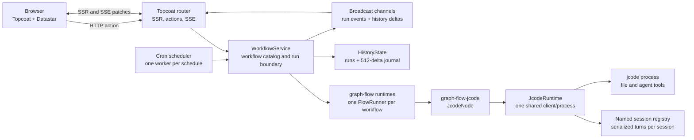
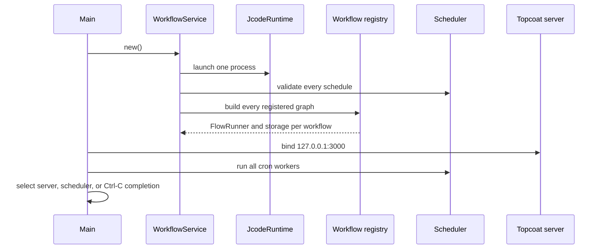
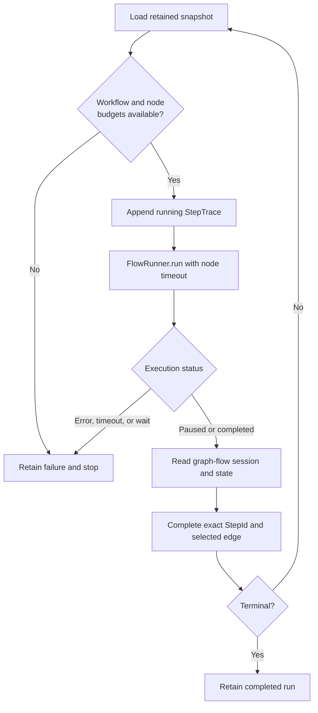

# Workflow Console Architecture

This document describes the current runtime architecture of Workflow Console Experiment.
It is a source-oriented reference for maintainers adding workflows, agent nodes, schedules, execution policies, or alternative graph renderers.

## 1. Purpose and boundaries

Workflow Console is a local-only orchestration surface for code-defined workflows.
It combines graph-flow for deterministic workflow progression with jcode for complete coding-agent turns that already understand file operations and agent tooling.

The application deliberately keeps the following concerns process-local:

- Workflow definitions and graph runners.
- The single jcode process and its session registry.
- Run snapshots, step traces, and history revisions.
- Cron workers and overlap ownership.
- Browser synchronization through server-rendered HTML and SSE.

The current architecture does not include a workflow designer, database, distributed scheduler, external queue, or multi-process coordination protocol.

## 2. System overview

The main architectural boundary is `WorkflowService`.
Manual actions, cron firings, page rendering, run-specific SSE, and history SSE all use the same service instance.

## 3. Process lifecycle

`src/main.rs` owns application startup and shutdown.

`WorkflowService::new` launches jcode before the HTTP server starts.
Startup fails if the jcode binary, GlossShift compatibility configuration, schedule definitions, execution limits, or graph definitions are invalid.
Tests that do not need a live agent process use `WorkflowService::without_jcode_runtime` and receive an unavailable agent task for the jcode workflow.

The Topcoat server and scheduler run in the same Tokio process under `tokio::select!`.
An unexpected scheduler or server exit terminates the application instead of leaving a partially functioning console.

## 4. Workspace and crate boundaries

| Boundary | Responsibility |
| --- | --- |
| `crates/graph-flow-jcode` | Generic graph-flow task, shared jcode process ownership, named sessions, SDK option factories, lifecycle hooks, and structured output. |
| `src/workflows` | Application workflow registry, forms, input parsing, graph construction, schedules, and workflow-specific integrations. |
| `src/workflow.rs` | Run start boundary, graph-flow runtime catalog, shared in-memory state, subscriptions, and schedule ownership. |
| `src/workflow/driver.rs` | Bounded one-step-at-a-time execution and conversion of graph-flow results into retained traces. |
| `src/workflow_scheduler.rs` | Cron validation, one worker per schedule, overlap policy, and scheduled dispatch. |
| `src/features` | Workflow launcher, selected-run inspector, history panel, SSE transports, and patch fragments. |
| `src/app` | Canonical routes, initial SSR, Datastar signals, navigation, and feature composition. |
| `src/features/run_detail/component/topology` | Replaceable topology layout and rendering contracts plus the current SVG implementation. |

The root package depends on `graph-flow-jcode` through a workspace path.
`graph-flow-jcode` depends on `jcode-sdk` directly from a pinned Git revision of `https://github.com/1jehuang/jcode`.

## 5. Workflow definition and registration

Each workflow owns a vertical slice below `src/workflows`.
A complete workflow provides the following contracts:

1. A stable `WORKFLOW_ID`.
2. A `WorkflowDefinition` containing the start node, immutable node and edge metadata, and optional limit overrides.
3. A server-rendered input form.
4. Default input values for the initial page signals.
5. Serde and garde input parsing that returns normalized `RunInput`.
6. A graph-flow graph whose task and transition IDs match the retained metadata.
7. Optional schedule input resolution.

`src/workflows.rs` is the central registry and currently contains three workflows:

| Workflow | Shape | Purpose |
| --- | --- | --- |
| `demo-workflow` | Six nodes with a conditional branch and convergence | Exercises branching, cron scheduling, overlap policies, and observable synthetic tasks. |
| `review-pipeline` | Four linear nodes | Exercises a simple inspect-and-approve path. |
| `jcode-translation` | One agent node | Reads a source file, asks jcode to translate it, writes the target, and validates the result. |

The registry routes form rendering, defaults, input parsing, graph construction, and scheduled input through exhaustive workflow-ID matches.
Adding only a `WorkflowDefinition` is insufficient because the HTTP and execution boundaries would not know how to initialize the workflow.
The project-local `workflow-console-add-workflow` skill contains the implementation checklist.

## 6. Run creation and graph-flow context

Both manual and cron execution enter through `WorkflowService::start`.
The boundary validates the workflow ID and parses workflow-owned input before retaining a run.

Each run receives:

- A UUID-based opaque `RunId`.
- A graph-flow `Session` starting at the definition's `start_node`.
- Its workflow ID as the graph ID.
- A `RunSnapshot` with `Running` status and the initial route summary.

The graph-flow context uses stable keys shared by workflow tasks and trace projection:

| Context key | Value | Purpose |
| --- | --- | --- |
| `workflow_input` | Normalized workflow-owned JSON | Initial task input and retained state projection. |
| `input_summary` | Short display string | Human-readable input summary for synthetic tasks and history. |
| `jcode_session_key` | Current `RunId` | Reuses one jcode session across every agent node in the same run. |
| `jcode_output` | `JcodeOutput` | Retains redacted agent output, tool calls, usage, and session identity. |

Using `RunId` as the jcode session key gives every workflow run an isolated agent conversation while allowing all jcode nodes within that run to share prior analysis and file-operation context.
A different session-sharing policy can be implemented by supplying another `SessionMode` factory to `JcodeNode`.

## 7. Bounded execution driver

The service creates one `FlowRunner` and one `InMemorySessionStorage` per workflow definition.
Starting a run saves its graph-flow session, retains the initial snapshot, emits `RunStarted`, and spawns the driver.

The driver executes one observable graph step at a time:

Every node execution receives a one-based run-local `StepId` and a one-based count for that node ID.
Repeated self-loop executions therefore append independent traces instead of overwriting the previous node state.
The driver completes or fails an exact `StepId`, so asynchronous UI updates cannot confuse two executions of the same node.

The driver derives the selected `EdgeSpec` from the current and next graph-flow task IDs.
The retained route, traversal counts, current node, current edge, trace output, and projected state are updated atomically before lifecycle and history events are emitted.

## 8. Execution limits

`WorkflowDefinition::limits` may override the application defaults.
Leaving it as `None` derives strict limits from the workflow's node count.

| Scope | Default | Enforcement point |
| --- | --- | --- |
| Workflow total steps | `node_count * 5` | Checked before every node execution. |
| Workflow total timeout | `max_steps * 5 minutes` | Tokio timeout around the complete driver. |
| Executions per node ID | `5` | Checked before executing the current node. |
| Timeout per node execution | `5 minutes` | Tokio timeout around one `FlowRunner::run`. |

All configured counts and durations must be non-zero, and derived arithmetic must not overflow.
Limit violations become retained failed runs and failed step traces where an active step exists.

Edge traversal counts are displayed, but edge-specific count and timeout enforcement is not implemented.
This is an explicit current limitation rather than an implied safety guarantee.

## 9. Generic jcode node architecture

### 9.1 One process, multiple sessions

`JcodeRuntime` owns exactly one `jcode_sdk::JcodeClient`, and that client owns one launched jcode process.
The runtime is wrapped in `Arc` and passed to every registered agent node.

`SessionMode` selects session behavior:

- `New` creates a distinct SDK session for the node execution.
- `Reuse(SessionKey)` creates the session on first use and returns the same process-local session thereafter.

The runtime rejects reuse of one key with a different working directory.
Each managed session has a turn mutex, so concurrent nodes sharing a session cannot interleave prompts or mutate the same conversation simultaneously.
Different sessions may use the shared client concurrently subject to the jcode process and SDK behavior.

### 9.2 Configurable SDK boundaries

`JcodeNode` accepts factories and hooks instead of embedding workflow-specific policy:

| Boundary | Configuration surface |
| --- | --- |
| Process launch | Complete SDK `LaunchOptions`, plus `before_launch` and `after_launch` runtime hooks. |
| Session selection | `SessionMode` factory using graph-flow `Context`. |
| Session configuration | `SessionOptions` for working directory, provider credentials, model, and reasoning effort. |
| Prompt | Prompt factory using the current graph-flow context. |
| Turn execution | Complete SDK `RunOptions` factory, mutable `before_run` hook, and mutable `after_run` result hook. |
| Graph continuation | Configurable graph-flow `NextAction`. |

The SDK client is exposed by `JcodeRuntime::client` for process-wide initialization that does not belong to a single node.
The crate re-exports `jcode_sdk` so consumers can use the exact SDK types without adding another dependency version.

`JcodeNode::run` uses `tokio::task::spawn_blocking` because the high-level SDK calls are blocking.
The node sets credentials and session model options, executes hooks, sends the prompt, records graph-flow conversation messages, and stores `JcodeOutput` in the context.

### 9.3 Application translation workflow

The current `jcode-translation` workflow uses a single `translate_files` node and ends after one complete coding-agent turn.
Its hooks construct a constrained translation prompt, allow jcode to read and write the requested relative files, and validate the target after the run.

The workflow reads GlossShift's selected provider configuration from its XDG config directory and maps it onto jcode's built-in `opencode-go` compatibility environment.
This adapter is intentionally isolated in `src/workflows/jcode_translation/glossshift.rs`.
Future first-class provider-profile and credential handling must replace that adapter without expanding the generic node crate with application-specific GlossShift knowledge.

Credential values are injected into launch environment or SDK calls and are not written to `RunSnapshot` or `StepState`.
`ProviderCredential` redacts its API key from `Debug` output.

### 9.4 Binary and example isolation

`just install-jcode` installs the pinned jcode binary below `.tools/jcode`.
`JCODE_BIN` may override the binary path, and the application otherwise resolves `.tools/jcode/bin/jcode` from the package root.
`.tools` and every `target` directory are ignored by Git.

The `graph-flow-jcode` example creates its input and output in an operating-system temporary workspace.
It does not create `.jcode`, MCP, skill, or translation fixture directories inside the repository.

## 10. Scheduler architecture

Schedules are immutable `ScheduleSpec` values registered in code.
Each specification includes a stable ID, workflow ID, six-field cron expression with seconds, input summary, and overlap policy.

Startup validation rejects:

- Duplicate schedule IDs.
- Unknown workflow IDs.
- Unknown or invalid scheduled input.
- Invalid cron expressions.
- An empty schedule registry.

`run_scheduler` parses every schedule and spawns one structured Tokio worker per expression in a `JoinSet`.
Each worker calculates its next UTC occurrence, sleeps until that instant, and dispatches through the same `WorkflowService::start` boundary used by manual actions.

The default `SkipWhileRunning` policy atomically claims the schedule ID before starting a run.
If the same schedule fires while its prior run remains active, the service retains a `Skipped` snapshot and emits `RunSkipped` instead of silently dropping the firing.
The claim is released when the run completes, fails, or cannot start.

`AllowOverlap` bypasses schedule ownership and starts every firing.
The policy is selected only from `ScheduleSpec`; the scheduler does not infer it from workflow behavior or file access.

## 11. Retained run, trace, and event state

`RunSnapshot` is the complete operator-facing state for one run.
It contains identity, workflow and input, trigger, lifecycle status, current topology position, traversed route, timestamps, and ordered step traces.

Run lifecycle states are:

- `Running`.
- `Completed`.
- `Failed` with a retained message.
- `Skipped` with a retained reason.

`StepTrace` retains:

- Stable `StepId`, global sequence, node ID, and per-node execution number.
- Running, completed, or failed status.
- Selected edge when the node chose a transition.
- State projected after execution.
- Output or failure text.
- Start, finish, and duration values.

Two broadcast channels serve different consumers:

| Channel | Payload | Primary consumer |
| --- | --- | --- |
| Workflow events | `RunStarted`, `NodeStarted`, `NodeCompleted`, `RunCompleted`, `RunFailed`, `RunSkipped` | Selected-run SSE and integration observers. |
| History events | Revisioned `HistoryDelta` | Filtered run-history SSE. |

History keeps all run snapshots in process memory for the lifetime of the server.
Its replay journal is independently bounded to 512 lightweight deltas containing only fields required for list membership.
This avoids cloning complete step traces into every replay entry while still supporting exact filter transitions.

## 12. HTTP, SSR, and SSE boundaries

| Route | Responsibility |
| --- | --- |
| `GET /` | Redirect to the default workflow's newest run or its canonical runless route. |
| `GET /workflows/{workflow_id}` | Redirect to that workflow's newest run or canonical runless route. |
| `GET /workflows/{workflow_id}/runs/` | Render a workflow topology when no retained run exists. |
| `GET /workflows/{workflow_id}/runs/{run_id}` | Render one exact retained run and its history panel. |
| `POST /actions/runs` | Parse Datastar signals, start a manual run, and navigate to its exact URL. |
| `GET /events/runs/{run_id}` | Patch the selected run inspector after matching workflow events. |
| `GET /events/history` | Replay and stream revisioned filtered history-row deltas. |

SSR owns the initial document, canonical URLs, workflow form defaults, selected run, history filters, and initial Datastar signals.
Datastar owns small client-side selection signals and applies server-rendered patches; there is no application-specific JavaScript state store.

The selected-run SSE subscribes to lifecycle events and re-renders only the run inspector for its run ID.
The history SSE subscribes to `HistoryDelta`, applies normalized workflow, trigger, and status filters, and emits insert, replace, remove, or empty-state patches.

The browser supplies both an `after` query cursor and SSE `Last-Event-ID` when reconnecting.
The server uses the greatest valid cursor, replays contiguous retained deltas, ignores duplicates, and reloads the page if a revision gap, receiver lag, or stale cursor prevents trustworthy patching.
The reload path re-establishes state from an atomic SSR `HistoryView`.

## 13. Topology and execution-history presentation

Topology data comes from `WorkflowDefinition`, never from a workflow-ID geometry table.

`TopologyLayoutEngine` defines the replaceable layout boundary.
The current `LayeredAutoLayout`:

- Excludes self-edges while computing incoming counts and ranks.
- Assigns nodes to deterministic rank rows in declaration order.
- Places unprocessed non-self cycles in fallback ranks instead of overlapping them at `(0,0)`.
- Routes forward edges with cubic curves.
- Routes self-edges above the node as external loops.
- Routes backward edges above the graph with lane offsets.
- Computes the SVG `viewBox` from placed nodes.

`TopologyRenderer` defines the replaceable rendering boundary.
The current `SvgTopologyRenderer` renders accessible SVG node and edge controls with active, traversed, selected, and execution-count states.
A future Mermaid or library-backed renderer can implement the same model without changing workflow execution or retained state.

The topology owns horizontal scrolling below its readable minimum width.
The page itself never uses horizontal scrolling as a layout mechanism.

The run inspector provides two related navigation surfaces:

- The graph selects a node or edge and follows its latest retained execution.
- The execution-history list selects an exact `StepId` in chronological order.

Each trace panel includes an execution selector for repeated visits to the same node or edge and a `Follow latest` control.
State and output blocks retain all text with internal overflow, including long serialized values and CJK output.

## 14. Failure and recovery behavior

The architecture retains failures at the closest observable boundary:

- Invalid HTTP input returns a request message without creating a run.
- Graph build, schedule validation, jcode launch, and invalid execution-limit configuration fail startup.
- Node errors and node timeouts fail the active `StepId` and run.
- Workflow timeout or total-step exhaustion fails the run.
- Missing graph-flow session or trace state fails the run instead of fabricating completion.
- Same-schedule overlap under the default policy creates a visible skipped run.
- SSE gaps or lag cause a full page reload from authoritative in-memory state.

There is no process recovery or persistence after application exit.
Restarting the server starts a new jcode process, clears named sessions, clears run history, resets history revisions, and restarts cron workers.

## 15. Extension points and invariants

### Add a workflow

Use the project-local `workflow-console-add-workflow` skill and update every registry boundary in one vertical slice.
Keep task IDs, `NodeSpec`, `EdgeSpec`, graph transitions, and trace expectations identical.

### Add multiple agent nodes

Pass the same run-owned `JCODE_SESSION_KEY` to `SessionMode::Reuse` when nodes belong to one coding task.
Use `SessionMode::New` or another stable key when a node requires isolation.
Do not create another `JcodeRuntime` per node or run.

### Replace graph rendering

Implement `TopologyRenderer` and, when appropriate, a corresponding `TopologyLayoutEngine`.
Keep execution identity based on workflow IDs and `StepId`; renderer-local element identity must not become the workflow state model.

### Change persistence or deployment topology

Treat persistence and multi-process scheduling as architectural migrations.
The current `RwLock`, broadcast channels, named jcode sessions, schedule claims, and history revision journal assume one process and cannot be made distributed by swapping only the run storage vector.

### Required invariants

- Exactly one jcode runtime is created during application startup.
- A workflow run owns one graph-flow session and one stable jcode session key.
- Every node execution appends a distinct `StepId`.
- Workflow and node limits are validated and enforced independently.
- Every schedule has a unique ID and explicit overlap policy.
- Skipped schedule firings remain visible in history.
- Topology layout is derived from definitions and never falls back to unknown IDs at `(0,0)`.
- Selected-run and history SSE streams remain separate.
- Credentials and provider secrets never enter retained trace or history state.

## 16. Current trade-offs

- Run history and jcode sessions are lost on restart.
- The run vector is unbounded even though the replay journal is bounded.
- Cron ownership is process-local and does not coordinate multiple replicas.
- A failed schedule worker terminates the scheduler and therefore the application.
- Edge-specific count and timeout limits are not enforced.
- The automatic layout is deterministic but intentionally simpler than a dedicated graph-layout library.
- The GlossShift provider mapping is a temporary compatibility adapter.
- The generic jcode crate exposes the most important launch, session, prompt, run, and hook boundaries, but future SDK additions may require explicit forwarding APIs.

These trade-offs are acceptable for the current local experiment and are the first boundaries to revisit before persistence, remote deployment, or large workflow graphs are introduced.
