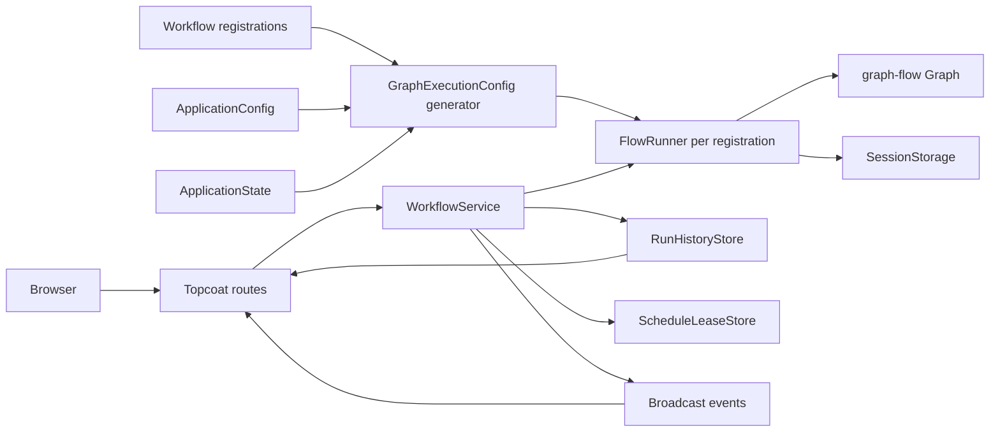
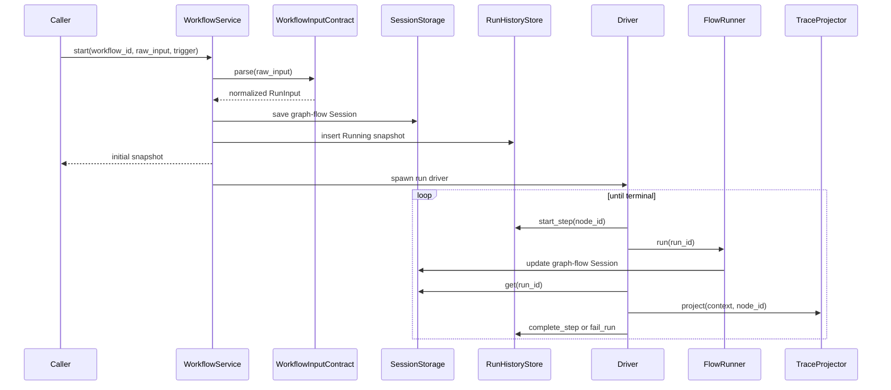

# Flowdeck architecture

## 1. Scope

Flowdeck is a local Topcoat application for registering, executing, scheduling, and inspecting code-defined graph-flow workflows.
The application core does not select an agent backend or interpret graph task implementations.
Its responsibility is to turn ordinary workflow registrations into generic graph-flow execution configurations, retain observable run state, and expose that state through HTTP, HTML, and SSE.

The architecture follows four ownership rules:

1. A workflow registration owns its executable graph, input contract, trace projection, and static presentation metadata.
2. Application configuration owns process-wide operational policy, not workflow or node behavior.
3. Application state is injected as one consistent backend bundle.
4. Optional node integrations capture their own resources before they cross the application boundary.

## 2. System overview



`WorkflowService` receives only registrations and generic application policy.
It never branches on graph topology, graph task type, or a concrete agent implementation.
Every registration follows the same `WorkflowRegistration -> GraphExecutionConfig -> FlowRunner` path.

## 3. Startup

The executable bootstrap in `src/main.rs` performs these operations:

1. Build `ApplicationConfig::local_default()`.
2. Pass the configuration to `WorkflowService::with_config`.
3. Construct the code-defined registration catalog.
4. Build one consistent `ApplicationState` backend bundle.
5. Generate one `GraphExecutionConfig` for every registration.
6. Construct each `FlowRunner` through the same generic path.
7. Load the compiled Topcoat asset bundle.
8. Bind the configured socket address.
9. Run the HTTP server, configured scheduler, and shutdown signal concurrently.

Optional node backends are not initialized during steps 1 through 8.
An unavailable optional backend therefore does not prevent the console, ordinary workflows, or their forms from starting.

## 4. Application configuration

`src/config.rs` is the process-wide policy root.
It is Rust code rather than a deserialized file so invalid and unsupported combinations remain unrepresentable in the first implementation.

```text
ApplicationConfig
├── http: HttpConfig
│   └── bind_address: SocketAddr
├── workflows: WorkflowConfig
│   └── execution: WorkflowExecutionDefaults
│       ├── step_multiplier: NonZeroUsize
│       ├── timeout_per_step: PositiveDuration
│       └── node: ExecutionTargetDefaults
│           ├── max_executions: NonZeroUsize
│           └── timeout: PositiveDuration
├── state: StateConfig
│   └── backend: StateBackendConfig
│       └── InMemory(InMemoryStateConfig)
│           └── history: InMemoryHistoryConfig
│               ├── run_retention: RunRetention
│               └── replay_capacity: NonZeroUsize
├── scheduler: SchedulerConfig
│   ├── mode: SchedulerMode
│   └── default_overlap_policy: ScheduleOverlapPolicy
└── events: EventConfig
    ├── workflow_capacity: NonZeroUsize
    └── history_capacity: NonZeroUsize
```

`PositiveDuration` validates non-zero durations once at the configuration boundary.
Count values use `NonZeroUsize` for the same reason.
Consumers receive validated values instead of repeating zero checks.

### 4.1 Local defaults

| Property | Default |
| --- | --- |
| HTTP bind address | `127.0.0.1:3000` |
| Workflow step limit | registered node count multiplied by `5` |
| Workflow timeout | derived maximum steps multiplied by `5 minutes` |
| Same-node execution limit | `5` per run |
| Node timeout | `5 minutes` |
| State backend | `InMemory` |
| Run retention | `Unlimited` for the process lifetime |
| History replay capacity | `512` deltas |
| Scheduler mode | `Enabled` |
| Inherited overlap policy | `SkipWhileRunning` |
| Workflow event capacity | `128` |
| History event capacity | `512` |

The logged server origin is derived from `http.bind_address` rather than stored as a second setting.

### 4.2 Configuration ownership

Application configuration does not contain form defaults, workflow prompts, cron expressions, graph geometry, agent credentials, or node SDK options.
Those values remain owned by presentation code, workflow definitions, or node integrations.
No application setting classifies a workflow as a coding, file-changing, or agent workflow.

## 5. Registration and execution configuration

`WorkflowRegistration` is the executable catalog boundary:

```text
WorkflowRegistration
├── definition: WorkflowDefinition
├── graph: Arc<graph_flow::Graph>
├── input: Arc<dyn WorkflowInputContract>
└── trace_projector: Arc<dyn TraceProjector>
```

The input contract parses manual input and produces input for code-defined schedules.
The trace projector converts selected graph context values into a redacted JSON payload.
The application never serializes the complete graph-flow `Context` because it may contain prompts, credentials, or internal state.

The catalog builds ordinary workflows and optional integration workflows independently, concatenates their registrations, and rejects duplicate workflow IDs.
It does not examine graphs or classify registrations by task type.

`generate_execution_config` combines a registration with application defaults and state:

```text
registration.definition + application execution defaults -> effective limits
registration.graph + application session storage          -> FlowRunner inputs
registration.input + registration.trace_projector         -> runtime contracts
```

Explicit workflow limit overrides remain authoritative.
Absent overrides are derived only from the registered node count and application defaults.

Presentation still looks up static forms and defaults by the selected workflow ID.
That lookup only selects code-defined UI; it does not alter graph construction, backend ownership, or the runner execution path.

## 6. Run lifecycle



The initial graph context contains only generic application values:

- normalized workflow input under `workflow_input`;
- display-safe input summary under `input_summary`;
- generic run identity under `workflow_run_id`.

Node integrations may interpret the generic run identity as part of their own session policy.
The application does not write integration-specific context keys.

## 7. Execution limits

The driver enforces both workflow-wide and node-specific limits:

- workflow wall-clock timeout;
- workflow total node execution count;
- node wall-clock timeout;
- execution count for the same node ID within one run.

The default total step limit is `node_count * 5`.
The default workflow timeout is `max_steps * 5 minutes`.
Each node may execute at most five times and each execution may take at most five minutes unless the workflow supplies an explicit override.

Self-edges are ordinary graph edges.
Repeated execution history is retained as separate `StepTrace` values with a stable one-based `StepId` and per-node execution count.
The same mechanism protects both intentional loops and accidental infinite self-loops.

## 8. State backend

`ApplicationState` separates immutable policy from live state instances:

```text
ApplicationState
├── graph_sessions: Arc<dyn SessionStorage>
├── run_history: Arc<dyn RunHistoryStore>
└── schedule_leases: Arc<dyn ScheduleLeaseStore>
```

The initial `StateBackendConfig::InMemory` builder creates all three stores as one consistent bundle.
`WorkflowService` does not construct `InMemorySessionStorage`, `HistoryState`, or a schedule ID set directly.

The shared graph session store is safe because run IDs are globally unique within the process.
Run history operations expose domain-level atomic commands rather than allowing the service to lock or mutate an in-memory collection directly.
Schedule leases expose only `claim` and `release`.

The database extension point is the backend enum plus these store contracts.
A future database backend must provide all three state categories, migrations, recovery behavior, and restart tests together.
The current code intentionally contains no database dependency, schema, or partial hybrid mode.

## 9. History, events, and replay

Every accepted run immediately creates a `RunSnapshot`.
The snapshot retains trigger, status, active topology, traversed topology, duration, and every node execution trace.

`RunHistoryStore` applies state changes atomically and returns `HistoryDelta` values.
The service publishes each delta through the configured history broadcast channel.
The history SSE endpoint replays retained deltas after a client revision and switches to a full reload when the cursor is older than the configured replay journal.

Workflow lifecycle events are a separate channel:

- `RunStarted`;
- `NodeStarted`;
- `NodeCompleted`;
- `RunCompleted`;
- `RunFailed`;
- `RunSkipped`.

The selected-run SSE endpoint uses these events to refresh the inspector.
Lagged subscribers recover from retained state instead of treating broadcast delivery as durable storage.

## 10. Scheduling and overlap

Each `ScheduleSpec` stores `ScheduleOverlap`:

- `ApplicationDefault` resolves through `SchedulerConfig::default_overlap_policy`;
- `Explicit(policy)` always uses the workflow-owned override.

The default application policy is `SkipWhileRunning`.
When the same schedule fires while it owns an active run, the attempt is retained as a `Skipped` snapshot with a reason and no graph steps.
`AllowOverlap` starts every firing.
No task category or file-changing heuristic participates in this decision.

The scheduler validates every code-defined schedule, starts one worker per schedule, and waits for the first worker failure.
`SchedulerMode::Disabled` skips schedule validation and workers while keeping manual workflow execution available.

Schedule leases are released after completion, failure, and start failure.
Skipped attempts never acquire a second lease.

## 11. Topology and execution history UI

The topology renderer consumes `WorkflowDefinition` and optional `RunSnapshot` data.
`LayeredAutoLayout` calculates ranks, rows, node coordinates, routed edges, self-edge curves, and the SVG view box from the registered topology.
Workflow definitions do not contain presentation coordinates.

The renderer is behind a topology layout interface so another representation, such as Mermaid or a graph library, can replace the current SVG layout without changing workflow execution.
Self-references use an exterior curve around the node rather than a special loop node.

Each run also exposes a linear execution-history list.
Selecting an item identifies one `StepId`, and the Step Trace execution selector can inspect repeated executions of the same node independently.

## 12. Optional node integrations

Agent runtimes are graph task implementation details, not application services.
The current jcode integration is an example of this rule:

1. `WorkflowTasks` attaches the application `ResourceStore` to each run driver with Tokio task-local scope.
2. Jcode-backed graph tasks capture a provider-neutral `ResourceKey` and process factory.
3. The bundle returns an ordinary `WorkflowRegistration`.
4. The first executing `JcodeNode` initializes and publishes one application-scoped process resource on the blocking pool.
5. Launch and SDK failures become failures of that exact node and run.

The one-resource policy applies to the console's current jcode integration bundle, not to every user of the reusable crate.
Another application may use multiple keys or isolated stores, and another workflow may use a completely different backend without changing `WorkflowService`.
Serializable graph-flow context retains only workflow state and identifiers; live clients, session locks, streams, and handles remain outside graph-flow serialization.

Jcode-specific lifecycle, session, SDK option, and hook details live in the [graph-flow-jcode architecture](../crates/graph-flow-jcode/docs/architecture.md).

## 13. Error boundaries

| Failure | Boundary |
| --- | --- |
| Unknown workflow or invalid input | `WorkflowError` before run insertion |
| Invalid graph or duplicate registration | registration/bootstrap failure |
| Invalid effective limits | bootstrap failure |
| Session storage failure | run start or driver failure |
| Node timeout or graph task failure | failed step and run |
| Trace projection failure | failed step and run |
| Invalid enabled schedule | bootstrap failure |
| Optional backend launch failure | failed node and run, not application startup |

## 14. Restart behavior

The current backend is entirely in memory.
Restarting the process loses graph-flow sessions, run snapshots, replay deltas, schedule leases, and optional integration conversations.
The configuration and state boundaries make a future persistent backend possible, but no recovery guarantee exists until such a backend is implemented and selected.

## 15. Architectural invariants

- Application execution does not branch on workflow ID, graph shape, task type, or agent backend.
- Every executable workflow crosses the application boundary as `WorkflowRegistration`.
- Every registration uses the same `GraphExecutionConfig -> FlowRunner` construction path.
- Application configuration contains generic operational policy only.
- State backend selection creates one internally consistent bundle.
- Complete graph-flow context is never retained as trace payload.
- Scheduled overlap is determined only by explicit schedule policy or the application default.
- Repeated node executions remain individually addressable.
- Optional backend availability cannot block application startup or ordinary workflows.
