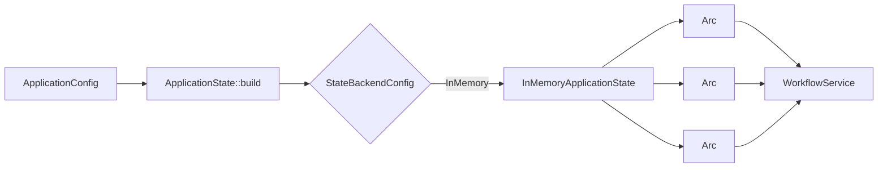

# Application configuration extraction plan

Status: implemented in `5976ad9`

The implementation follows this report with an InMemory-only `ApplicationConfig`, injected state bundle, inherited schedule policy, configurable limits and channel capacities, scheduler mode, and configured HTTP bind address.

## 1. Decision summary

Add a root-package `src/config.rs` that contains only application-wide policy values.
The first implementation supports only process-local in-memory state, while its type boundary allows a later persistent backend to supply the same state services.

The configuration must not contain jcode, Rig, or another agent-backend setting.
Agent-node process, session, provider, prompt, and hook policy belongs to the workflow integration or its node crate.

The initial change is intentionally code-defined.
It does not add TOML, environment deserialization, a database dependency, migrations, or runtime reload.

## 2. Verified current state

The following application-wide values are currently distributed across source files:

| Current location | Current value or construction | Target configuration path |
| --- | --- | --- |
| `src/main.rs` | `127.0.0.1:3000` | `http.bind_address` |
| `src/workflow_limits.rs` | workflow step multiplier `5` | `workflows.execution.step_multiplier` |
| `src/workflow_limits.rs` | workflow timeout per step `5 minutes` | `workflows.execution.timeout_per_step` |
| `src/workflow_limits.rs` | node execution limit `5` | `workflows.execution.node.max_executions` |
| `src/workflow_limits.rs` | node timeout `5 minutes` | `workflows.execution.node.timeout` |
| `src/workflow.rs` | workflow event channel capacity `128` | `events.workflow_capacity` |
| `src/workflow.rs` | history event channel capacity `512` | `events.history_capacity` |
| `src/workflow/history.rs` | replay journal capacity `512` | `state.in_memory.history.replay_capacity` |
| `src/workflow/history.rs` | unbounded retained run vector | `state.in_memory.history.run_retention` |
| `src/workflow.rs` | one `InMemorySessionStorage` per workflow | selected by `state.backend` |
| `src/workflow.rs` | `HistoryState` under one `RwLock` | selected by `state.backend` |
| `src/workflow.rs` | schedule claims in `Mutex<HashSet<String>>` | selected by `state.backend` |
| `src/workflow_scheduler.rs` | scheduler always enabled | `scheduler.mode` |
| `src/workflow_scheduler.rs` | default overlap is `SkipWhileRunning` | `scheduler.default_overlap_policy` |

The topology geometry constants, redirect delay, workflow forms, workflow input defaults, workflow schedules, and jcode translation limits do not move to `ApplicationConfig`.
They are presentation policy or workflow-owned policy rather than application runtime policy.

## 3. Exact initial type model

The following is the planned public shape for the first in-memory-only implementation.
All fields are shown down to their leaf values.

```rust
use std::{
    net::{IpAddr, Ipv4Addr, SocketAddr},
    num::NonZeroUsize,
    time::Duration,
};

#[derive(Clone, Debug, PartialEq, Eq)]
pub struct ApplicationConfig {
    pub http: HttpConfig,
    pub workflows: WorkflowConfig,
    pub state: StateConfig,
    pub scheduler: SchedulerConfig,
    pub events: EventConfig,
}

#[derive(Clone, Debug, PartialEq, Eq)]
pub struct HttpConfig {
    pub bind_address: SocketAddr,
}

#[derive(Clone, Debug, PartialEq, Eq)]
pub struct WorkflowConfig {
    pub execution: WorkflowExecutionDefaults,
}

#[derive(Clone, Debug, PartialEq, Eq)]
pub struct WorkflowExecutionDefaults {
    pub step_multiplier: NonZeroUsize,
    pub timeout_per_step: PositiveDuration,
    pub node: ExecutionTargetDefaults,
}

#[derive(Clone, Debug, PartialEq, Eq)]
pub struct ExecutionTargetDefaults {
    pub max_executions: NonZeroUsize,
    pub timeout: PositiveDuration,
}

#[derive(Clone, Copy, Debug, PartialEq, Eq)]
pub struct PositiveDuration(Duration);

#[derive(Clone, Debug, PartialEq, Eq)]
pub struct StateConfig {
    pub backend: StateBackendConfig,
}

#[derive(Clone, Debug, PartialEq, Eq)]
pub enum StateBackendConfig {
    InMemory(InMemoryStateConfig),
}

#[derive(Clone, Debug, PartialEq, Eq)]
pub struct InMemoryStateConfig {
    pub history: InMemoryHistoryConfig,
}

#[derive(Clone, Debug, PartialEq, Eq)]
pub struct InMemoryHistoryConfig {
    pub run_retention: RunRetention,
    pub replay_capacity: NonZeroUsize,
}

#[derive(Clone, Debug, PartialEq, Eq)]
pub enum RunRetention {
    Unlimited,
}

#[derive(Clone, Debug, PartialEq, Eq)]
pub struct SchedulerConfig {
    pub mode: SchedulerMode,
    pub default_overlap_policy: ScheduleOverlapPolicy,
}

#[derive(Clone, Copy, Debug, PartialEq, Eq)]
pub enum SchedulerMode {
    Enabled,
    Disabled,
}

#[derive(Clone, Debug, PartialEq, Eq)]
pub struct EventConfig {
    pub workflow_capacity: NonZeroUsize,
    pub history_capacity: NonZeroUsize,
}
```

`ScheduleOverlapPolicy` remains the existing workflow scheduler domain enum:

```rust
#[derive(Clone, Copy, Debug, Default, PartialEq, Eq)]
pub enum ScheduleOverlapPolicy {
    #[default]
    SkipWhileRunning,
    AllowOverlap,
}
```

`PositiveDuration::new` validates non-zero durations once at the configuration boundary.
The rest of the application receives a value that cannot represent a zero timeout.

## 4. Exact initial defaults

`ApplicationConfig::local_default()` produces the current behavior:

| Property | Initial value | Reason |
| --- | --- | --- |
| `http.bind_address` | `127.0.0.1:3000` | Preserve the local-only security boundary. |
| `workflows.execution.step_multiplier` | `5` | Preserve `node_count * 5` workflow step limits. |
| `workflows.execution.timeout_per_step` | `5 minutes` | Preserve `max_steps * 5 minutes` workflow timeout derivation. |
| `workflows.execution.node.max_executions` | `5` | Preserve the current self-loop protection. |
| `workflows.execution.node.timeout` | `5 minutes` | Preserve the current node timeout. |
| `state.backend` | `InMemory` | The only supported backend in the first implementation. |
| `state.in_memory.history.run_retention` | `Unlimited` | Preserve all run snapshots for the process lifetime. |
| `state.in_memory.history.replay_capacity` | `512` | Preserve the current bounded replay journal. |
| `scheduler.mode` | `Enabled` | Preserve cron startup and validation. |
| `scheduler.default_overlap_policy` | `SkipWhileRunning` | Preserve skipped-history behavior as the default. |
| `events.workflow_capacity` | `128` | Preserve the current lifecycle event channel. |
| `events.history_capacity` | `512` | Preserve the current history event channel. |

The logged server URL is derived from `http.bind_address`; it is not a second independently configurable string.
This prevents the bind address and displayed origin from drifting apart in the local-only application.

## 5. Per-schedule overlap resolution

`ScheduleSpec::new` currently stores `SkipWhileRunning` immediately, so an application default cannot affect it later.
The plan changes the schedule declaration to preserve whether the workflow inherited or explicitly overrode the application policy:

```rust
#[derive(Clone, Copy, Debug, Default, PartialEq, Eq)]
pub enum ScheduleOverlap {
    #[default]
    ApplicationDefault,
    Explicit(ScheduleOverlapPolicy),
}
```

`ScheduleSpec` stores `ScheduleOverlap`.
The scheduler resolves `ApplicationDefault` through `config.scheduler.default_overlap_policy` and uses `Explicit(policy)` unchanged.
The existing `*/10` demo schedule inherits `SkipWhileRunning`, while the existing `*/15` demo schedule remains an explicit `AllowOverlap` case.

No workflow behavior, file access, or task category participates in overlap resolution.

## 6. State backend boundary

Configuration data and live state instances must remain separate.
`ApplicationConfig` selects a backend, while a bootstrap function creates the instances injected into `WorkflowService`.



The injected runtime bundle is planned as:

```rust
pub struct ApplicationState {
    pub graph_sessions: Arc<dyn graph_flow::SessionStorage>,
    pub run_history: Arc<dyn RunHistoryStore>,
    pub schedule_leases: Arc<dyn ScheduleLeaseStore>,
}
```

The application will add two narrow traits around existing state that is not covered by graph-flow:

| Trait | Current implementation | Required operations |
| --- | --- | --- |
| `RunHistoryStore` | `InMemoryRunHistoryStore` wrapping current `HistoryState` | insert, mutate, get, view, replay |
| `ScheduleLeaseStore` | `InMemoryScheduleLeaseStore` wrapping the current schedule ID set | claim and release |

The initial backend creates these three process-local stores.
`WorkflowService` no longer constructs `InMemorySessionStorage`, `HistoryState`, or `HashSet` directly.

The builder owns backend consistency.
Callers cannot independently request database history with in-memory sessions unless a later explicit hybrid backend supports and documents that recovery model.

## 7. Future database extension point

The initial enum intentionally contains only `StateBackendConfig::InMemory`.
A database variant must be added only together with its implementation, migrations, recovery tests, and operational documentation.

The expected future shape is recorded here to keep the first boundary compatible, but it is not part of the initial code change:

```rust
pub enum StateBackendConfig {
    InMemory(InMemoryStateConfig),
    Database(DatabaseStateConfig),
}

pub struct DatabaseStateConfig {
    pub connection: DatabaseConnectionConfig,
    pub migrations: MigrationPolicy,
    pub recovery: RecoveryPolicy,
    pub schedule_lease_ttl: PositiveDuration,
    pub history: DatabaseHistoryConfig,
}

pub struct DatabaseConnectionConfig {
    pub url: SecretDatabaseUrl,
    pub min_connections: u32,
    pub max_connections: NonZeroU32,
    pub connect_timeout: PositiveDuration,
    pub acquire_timeout: PositiveDuration,
    pub idle_timeout: Option<PositiveDuration>,
    pub max_lifetime: Option<PositiveDuration>,
}

pub enum MigrationPolicy {
    Validate,
    Apply,
}

pub enum RecoveryPolicy {
    MarkInterruptedFailed,
    ResumeRecoverable,
}

pub struct DatabaseHistoryConfig {
    pub run_retention: RunRetention,
    pub replay_retention: ReplayRetention,
}

pub enum RunRetention {
    Unlimited,
    KeepLatest(NonZeroUsize),
    KeepFor(PositiveDuration),
}

pub enum ReplayRetention {
    KeepLatest(NonZeroUsize),
    KeepFor(PositiveDuration),
}
```

The database URL must use a redacted secret wrapper and must never appear in `Debug`, trace state, history, or logs.
`ResumeRecoverable` remains unavailable until graph reconstruction, node idempotency, in-flight step recovery, and scheduler lease takeover are defined.
The safe first database policy is `MarkInterruptedFailed`.

## 8. Construction and ownership flow

The target startup order is:

1. Construct `ApplicationConfig::local_default()` in `main`.
2. Validate all positive counts, durations, and local bind requirements.
3. Build `ApplicationState` from `config.state`.
4. Construct the workflow registry independently from application-wide state configuration.
5. Construct `WorkflowService` from config defaults, state services, and workflow registrations.
6. Start the scheduler only when `scheduler.mode` is `Enabled`.
7. Bind the HTTP server using `http.bind_address`.

`ApplicationConfig` is immutable after startup and is shared by `Arc` only where ownership requires it.
Consumers should receive the smallest nested config value they need rather than the whole application config.

## 9. Planned file changes

| File | Planned responsibility |
| --- | --- |
| `src/config.rs` | Configuration types, validated constructors, and `local_default`. |
| `src/lib.rs` | Module registration and deliberate public re-exports. |
| `src/main.rs` | Build config, state services, workflow service, scheduler, and listener. |
| `src/workflow.rs` | Accept injected state services and event capacities. |
| `src/workflow/history.rs` | Implement `RunHistoryStore` for the existing in-memory state. |
| `src/workflow_scheduler.rs` | Resolve scheduler mode and inherited overlap policy; use `ScheduleLeaseStore`. |
| `src/workflow_limits.rs` | Derive effective limits from `WorkflowExecutionDefaults`; retain workflow overrides. |
| `tests/` | Lock current defaults and injected in-memory behavior through public APIs. |

The existing `crates/graph-flow-jcode/src/config.rs` remains the node crate's SDK-facing session configuration.
It must not be merged with the new root `src/config.rs`.

## 10. Implementation sequence

1. Add typed configuration values and tests for the exact current defaults.
2. Pass execution defaults into `WorkflowDefinition::execution_limits` without changing workflow-level overrides.
3. Move event capacities and bind address to their config consumers.
4. Introduce `RunHistoryStore` and `ScheduleLeaseStore` around the current in-memory implementations.
5. Build one `ApplicationState` bundle from `StateBackendConfig::InMemory` and inject it into `WorkflowService`.
6. Resolve inherited schedule overlap through `SchedulerConfig`.
7. Add disabled-scheduler startup behavior without weakening schedule validation when enabled.
8. Update English architecture documentation, then regenerate and review the Japanese version with GlossShift.

The jcode runtime ownership separation described in [Jcode runtime separation plan](jcode-runtime-separation.md) should land first.
Otherwise the new application config risks preserving jcode as a false application-wide dependency.

## 11. Validation plan

The change is accepted when all of the following are observable:

- `ApplicationConfig::local_default()` reproduces every value in the defaults table.
- A non-jcode workflow starts and completes with only `StateBackendConfig::InMemory` configured.
- Workflow total limits still derive from node count, and explicit workflow overrides still win.
- The default schedule policy records a skipped run while an explicit `AllowOverlap` schedule starts another run.
- Disabled scheduler mode allows the server to run without starting schedule workers.
- In-memory history replay becomes stale at the configured boundary rather than a fixed constant.
- `WorkflowService` contains no direct construction of `InMemorySessionStorage`, `HistoryState`, or the schedule claim set.
- No application configuration type mentions jcode or another optional agent backend.
- Formatting, Clippy, unit tests, integration tests, and one live HTTP run pass.

## 12. Non-goals

- External config file parsing.
- Environment-variable overrides beyond existing tool-specific compatibility behavior.
- Dynamic reload.
- Database dependencies, migrations, or connection pools.
- Cross-process schedule coordination.
- Recovery of a partially executed workflow.
- Agent-node provider configuration in the application config.
