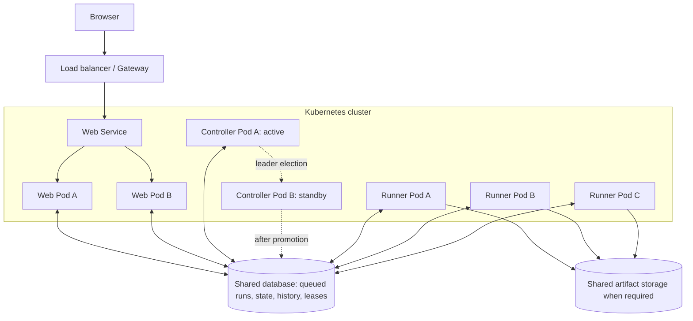
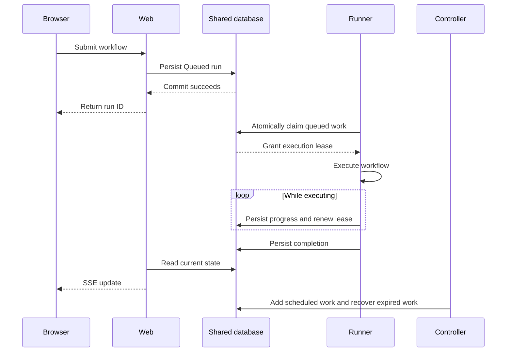
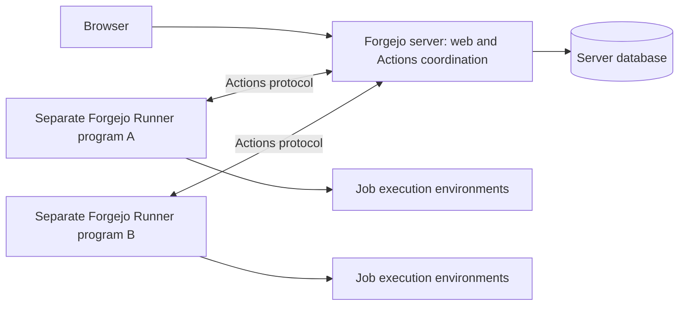

# Future high-availability deployment discussion

Status: exploratory discussion, not an approved implementation plan.
Started: 2026-09-05.
This document records the architecture discussion and will be updated as the conversation continues.
Repository artifacts are written in English, while conversational responses are in Japanese.
No application implementation or deployment change is authorized by this discussion.

## 1. Goals and initial questions

Flowdeck currently prioritizes a simple single-binary deployment that can run in a small container.
The future question is how to deploy it on Kubernetes with high availability without losing that simplicity.
The initial proposed roles are a controller, a combined frontend/backend web service, and runners, with an externally operated database.
The explanation should be accessible to someone with limited Kubernetes application-operating experience.

High availability must be separated into several objectives: continued HTTP availability, durable acceptance of runs, continued scheduling, and safe recovery of interrupted workflow execution.
A replicated web service does not imply uninterrupted or exactly-once workflow execution.
Recovery time and acceptable data loss depend on application policy and database guarantees, not merely the number of Pods.

## 2. Observed implementation baseline

The initial investigation included uncommitted working-tree changes present on 2026-09-05, including remote Turso support.
These observations describe that inspected tree rather than a guarantee about a published release.

- `src/workflow.rs`: `WorkflowService::start` validates input, obtains process-local admission, inserts a running snapshot and graph session, and spawns the driver inside the same process.
- `src/workflow.rs` and `src/features/run_detail/sse.rs`: lifecycle notifications use a process-local Tokio broadcast channel, and SSE re-reads stored state after local notifications.
- `src/workflow/state.rs`: sessions, history, and schedule leases are interfaces backed by one Turso store.
- `src/storage.rs`: schedule claims insert a unique schedule ID, without a distributed owner, renewal deadline, or execution-generation protocol.
- `src/storage.rs`: startup recovery marks existing running snapshots failed and removes schedule leases.
- `src/storage/README.md`: file-backed operation holds a lifetime exclusive file lock.
- `src/storage/README.md`: remote mode uses a local Turso replica with synchronization, not remote-only SQL transport; one Flowdeck writer per remote database is supported.
- The remote storage contract does not support other processes writing during operation, distributed leases, or a continuous remote pull loop.
- The concurrency semaphore, task tracking, executable graphs, live clients, process handles, and runtime resources remain process-local.
- `AGENTS.md`: the current server is intentionally local-only and binds to `127.0.0.1`.
- `docs/architecture.md`: persisted graph state does not make live provider sessions or external effects restartable.

Consequently, changing the database URL and increasing the Deployment replica count is not a supported HA configuration.
In particular, unmodified startup recovery could classify another process's live run as interrupted if the storage were naively shared.

## 3. Kubernetes vocabulary

A Node is the VM or physical machine hosting containers.
A Pod is the execution unit; for this discussion, it approximately corresponds to one Flowdeck process.
A Deployment maintains a desired number of Pods and manages their replacement and rollout.
A Service provides a stable network endpoint for selected Pods.
The proposed web and runner "nodes" should normally be interpreted as application Pods, not dedicated machines.
The Flowdeck controller is an application component, not the Kubernetes control plane.

## 4. Candidate architecture



| Component | Responsibility | Initial redundancy model |
| --- | --- | --- |
| Web | UI, API, input validation, durable submission, history, progress | Multiple active replicas |
| Controller | Scheduled submissions, expired-run detection, recovery policy | Multiple replicas with one active leader |
| Runner | Claim work, execute workflows, persist progress and results | Multiple active replicas handling different runs |
| Database | Authoritative accepted work and execution state | HA and backups operated separately |
| Artifact storage | Durable outputs, logs, and checkpoints where required | Accessible independently of a particular runner |

A dedicated message broker is not a prerequisite.
A transactional shared database can initially hold the durable queue and coordinate atomic work claims.
The selection of database and adapter must establish the required locking, consistency, and transaction semantics.
PostgreSQL is a candidate, not a verified drop-in replacement for the current Toasty/Turso implementation.

### Submission and execution



The controller should not be a mandatory forwarding hop for every manual submission.
If it is temporarily unavailable, manual submission and consumption of existing queued work can continue while the database, web, and runners remain healthy.
Scheduled submission and expired-work recovery may pause until leadership is restored.
Run insertion must be durable before reporting successful acceptance, and retries after uncertain responses need submission-level deduplication.

Initially, one runner should own an entire workflow run rather than dispatching every graph step to another machine.
This is closer to the current driver and process-local resource model.
Step-level distribution is an additional design problem, not required for the first distributed deployment.

## 5. Database responsibilities

Operating database replication, failover, backups, and restore is outside the application.
Correct concurrent access remains an application responsibility.
Once a distributed-capable storage layer exists, deployment configuration can largely supply its endpoint and credentials.
Building that layer still requires appropriate SQL, migrations, transactions, conditional updates, and concurrency tests.
Database failover can interrupt connections or leave the outcome of a transaction unknown.
Connection recovery, bounded timeouts, and idempotent request handling remain necessary.
Backups protect against data loss scenarios that replication alone does not address.

The existing local file lock is not cross-machine coordination.
Sharing the current SQLite file across Pods or pointing multiple syncing replicas at one remote database does not establish the required execution ownership guarantees.

## 6. Runner failure and safe recovery

A future execution claim could retain the following fields:

```text
run_id
status = Running
owner = runner-A
lease_expires_at
execution_generation
```

A lease is a time-limited execution right that the runner renews while it remains healthy.
The controller detects expiration and applies the workflow's recovery policy.
Requeueing must be conditional and atomic so multiple recovery attempts cannot independently claim the same transition.
Current schedule-overlap claims are not equivalent to this execution-lease protocol.

Lease expiry does not prove that the old process has stopped.
A disconnected runner can still be executing external work when a replacement starts.
Owner and generation checks must reject stale state updates; this is a fencing mechanism.
Database fencing alone cannot prevent stale external API calls or filesystem side effects.

### External side effects and ambiguous outcomes

A runner can successfully perform an external operation and crash before recording its success.
A replacement cannot infer from the missing database result that the external operation never happened.
Neither Kubernetes Pod replacement nor a Kubernetes Job guarantees exactly-once external effects.

| Operation type | Candidate recovery policy |
| --- | --- |
| Reads or repeatable computation | Automatic retry |
| Naturally idempotent updates | Automatic retry under the operation's contract |
| API with idempotency keys | Retry with a stable key for the logical operation |
| Unsafe operation with unknown outcome | Stop for reconciliation or human review |

An initial HA release can preserve accepted work and classify interruption accurately without transparently resuming every workflow.
Safe retries and an explicit interrupted/needs-review outcome are preferable to blindly replaying side effects.
The current recovery policy deliberately avoids rerunning graph tasks or external effects.

## 7. Controller redundancy

An active/standby controller arrangement is a reasonable first design, not a universal requirement.
Leadership can be coordinated through Kubernetes Lease objects or a suitable database lease.
Using a database mechanism can keep the application less tied to Kubernetes, while Kubernetes leases reuse cluster coordination APIs.
Leadership loss must stop leader-only work, but leader election must not be the only correctness boundary.

Scheduled submission should have a uniqueness key such as schedule ID plus intended firing time.
A leader transition must not create the same scheduled run twice.
The system also needs a policy for missed firing times: catch up, coalesce, or skip.
This deduplication is separate from the current policy of skipping a schedule while its previous execution is running.

## 8. Web redundancy and progress updates

A web replica must not depend on receiving a process-local runner broadcast.
Initially each web replica can periodically read shared authoritative state and send SSE patches to its connected clients.
Notifications through a database or Pub/Sub can be added when latency or load justifies them.
Notifications should remain hints with a database resynchronization path, unless a durable replay protocol is explicitly designed.
SSE reconnects should recover from shared state regardless of which web replica receives the connection.
Sticky sessions should not be a correctness requirement.
Gateway buffering and idle timeouts must accommodate SSE.

Authentication and session state must likewise work across replicas if introduced.
Moving beyond loopback-only operation requires an explicit authentication, TLS, authorization, and network exposure design.

## 9. Runner deployment alternatives

| Approach | Benefits | Costs and risks |
| --- | --- | --- |
| Long-lived runner Deployment | Fast pickup, resource reuse, close to the current process model | Execution isolation, memory management, graceful draining |
| One Kubernetes Job per run | Per-run resources, identities, workspaces, and isolation | Startup overhead, Job lifecycle management, reconciliation |

Long-lived runners are the initial recommendation for continuity with the current implementation.
Per-run Jobs become attractive when executing untrusted commands, isolating users, or applying substantially different resource requirements.
One runner per workflow run does not imply one Kubernetes Job per graph node.
A Kubernetes Job can recreate failed Pods and can also produce duplicate execution attempts.

Database insertion and Kubernetes Job creation are not a single transaction.
A Job-based controller must reconcile accepted work against observed Jobs and tolerate retries, using stable identities and duplicate-safe creation.

Live SDK processes, provider sessions, locks, and local workspaces do not become reconstructible merely because graph state is persisted.
Durable provider descriptors, homes, and cross-process resumption are related to the existing issue: https://github.com/totto2727-org/flowdeck/issues/3.
This discussion does not claim that the full distributed recovery design is implemented or covered by that issue.

## 10. Infrastructure and operations

- Spread replicas across Nodes and, when the availability objective requires it, availability zones.
- Multiple replicas on one Node do not tolerate that Node's failure.
- Use readiness to remove unavailable web replicas from new-request routing.
- Configure startup and liveness probes to avoid restart storms during startup or dependency outages.
- Handle termination signals and drain runners by stopping new claims before finishing or safely interrupting active work.
- Set termination grace periods consistent with the execution and checkpoint policy.
- Use PodDisruptionBudgets for eligible voluntary evictions, not as protection against involuntary hardware failures.
- Configure Deployment rolling updates separately; PDBs do not constrain their rollout algorithm.
- Monitor queue age, capacity, lease expiry, runner failures, and database errors.
- Define runner-local and cluster-wide concurrency limits separately.
- Separate credentials and permissions by role, including runner permissions to external systems.
- Include the entrypoint, database, storage, and Kubernetes infrastructure in the HA failure-domain assessment.

Code-defined workflow versions must be accounted for during rolling updates.
Persist a definition/version identity and ensure that a runner only executes compatible work.
Do not accidentally resume an old run against unrelated new graph code.
Database migrations need coordinated application and compatibility with overlapping old/new application versions.

## 11. Preserve simple packaging

The following is an illustrative future CLI, not existing functionality:

```text
flowdeck serve --role=all
flowdeck serve --role=web
flowdeck serve --role=controller
flowdeck serve --role=runner
```

One binary or image can contain all roles while separate processes enable only the selected role.
Small installations can retain an all-in-one mode without requiring Kubernetes or an external broker.
Optional runtime dependencies must not be eagerly initialized in roles that do not need them.
Role selection must determine actual listeners, workers, recovery routines, and privileges, not merely hide UI features.

### Suggested progression

1. Run a single instance on Kubernetes with explicit persistence and replacement behavior; this is operational recovery, not continuous service HA.
2. Introduce durable queued submission and execution ownership, split web from runners, and replicate web with conservative interruption handling.
3. Replicate controllers and implement recovery and automatic retries where safe.
4. Add per-run Jobs, durable checkpoints, or load-based scaling when justified.

The essential application changes are durable queueing, time-limited execution ownership, cross-process state observation, and safe failure recovery.

## 12. Follow-up: is a role-selecting single binary conventional?

Question recorded on 2026-09-05: Is starting one binary in different roles an established approach, and do Forgejo and Forgejo Runner work that way?

### Verified examples and distinction

A role-selecting binary is an established production architecture, but it is not a Kubernetes requirement or the only conventional approach.
No prevalence survey was performed; "established" here means documented production use, not a claim that most systems use it.

Grafana Loki documents that its components exist in the same binary, with startup selection through `-target`.
`-target=all` runs its components together, while microservices deployment starts selected components as separate processes from that binary.
This directly demonstrates the packaging pattern proposed for Flowdeck.
The current Loki documentation also marks its Simple Scalable Deployment mode as deprecated toward Loki 4.0; that mode is not the recommendation or dependency of this proposal.

Forgejo and Forgejo Runner instead use separate programs, installed and configured separately.
The official Actions guide says Forgejo does not execute the Actions jobs itself and delegates them to runners.
A runner fetches work from a Forgejo instance, and multiple runner installations can connect to one instance.
Runners register with Forgejo and use its Actions protocol rather than being instructed to connect directly to the server's application database.
The guide also permits alternative runner implementations that speak the same protocol.



This is a responsibility-boundary sketch, not a verified complete Forgejo HA topology.
Multiple runners provide execution capacity and distribution but do not alone make the Forgejo server highly available.
The investigated guide does not establish a separately deployable Forgejo-only controller role equivalent to the proposed Flowdeck controller.

### Three independent design decisions

1. **Responsibilities:** which component handles HTTP, scheduling, and execution?
2. **Packaging:** do these components ship in one binary or separate binaries/images?
3. **Communication:** do workers use a shared database, an application API, or a broker?

A single binary can still use an API between roles and run under different credentials in separate Pods.
Separate binaries can share implementation libraries and remain in one repository.
A binary boundary is not by itself a security boundary; deployment identity, network access, secrets, and process isolation matter.

| Choice | Advantages | Trade-offs |
| --- | --- | --- |
| One binary with roles | Simple distribution, common versioning, easy all-in-one operation | Carries unrelated role code; release cadence is coupled; initialization boundaries must remain clean |
| Separate server and runner binaries | Smaller role-specific packaging, independent dependencies and release possibilities | More artifacts and protocol compatibility management; all-in-one experience needs explicit support |

Independent releases still require a defined compatibility contract, and one binary does not remove mixed-version concerns during rollouts.

### Implication for Flowdeck

The previous single-binary recommendation follows Flowdeck's current simplicity goal; it is not a claim that Forgejo uses that packaging or that separate binaries are inferior.
Keep responsibility boundaries explicit first, then choose packaging according to distribution and security needs.
A private, trusted Kubernetes runner pool could start with database-backed coordination as outlined above.
For externally operated runners or runners executing untrusted code, a server-mediated runner API with scoped credentials is a stronger candidate because direct database credentials expose a broader trust boundary.
This API option does not require splitting the executable: `flowdeck --role=runner` could use the same protocol as a future separate runner binary.
The shared-database diagram is therefore an initial candidate, not a settled communication contract.

## 13. Sources

Local implementation sources are listed in section 2.
Official sources consulted on 2026-09-05:

- Kubernetes Leases: https://kubernetes.io/docs/concepts/architecture/leases/
- Kubernetes Jobs, including duplicate execution caveats: https://kubernetes.io/docs/concepts/workloads/controllers/job/
- Kubernetes Pod topology spread: https://kubernetes.io/docs/concepts/scheduling-eviction/topology-spread-constraints/
- Kubernetes disruptions and PDB limitations: https://kubernetes.io/docs/concepts/workloads/pods/disruptions/
- Forgejo Actions administrator guide: https://forgejo.org/docs/latest/admin/actions/runner-installation/
- Grafana Loki deployment modes: https://grafana.com/docs/loki/latest/get-started/deployment-modes/

Official `latest` documentation is mutable; these notes record the distinctions verified at the time of discussion.

## 14. Open decisions

- Required availability objectives, recovery time, and acceptable data loss.
- Which workflows permit automatic retry or cross-process resumption.
- Trusted in-cluster runners versus externally operated or untrusted execution workers.
- Shared database access versus an authenticated runner API.
- Storage backend and transactional coordination implementation.
- All-in-one and role-specific packaging, with separate binaries remaining an option.
- Workflow-version compatibility and migration coordination.
- Whether this exploratory discussion should later become approved ADRs or tracked implementation work.

These are unresolved design choices, not implementation tasks silently excluded from an authorized change.

## 15. Clarification: two independent questions

On 2026-09-05, the user clarified that the single-binary role-selection question and Forgejo as an example of queued runner execution were independent questions.
Future responses should address each separately, lead with conclusions, and omit investigation narration and unnecessary detail.

### Single binary with selectable roles

Conclusion: this is an established deployment pattern, demonstrated by Loki's documented component selection within one binary.
It is a suitable option for preserving Flowdeck's simple all-in-one distribution, but it is not required for HA.

### Forgejo as a queued runner architecture example

Conclusion: Forgejo Actions is a relevant example of a server managing pending work and separate runners fetching and executing it.
The official guide verifies runner-side fetching and multiple runners per Forgejo instance; this comparison does not assert a particular internal queue implementation or require an external message broker.
The conceptual flow is submission, server-managed pending work, runner pickup, execution, and result reporting.
This illustrates decoupled execution and a runner pool, not proof of complete system HA.
Server and database availability, interrupted-job recovery, and duplicate-side-effect handling must be assessed separately.
Flowdeck can adopt that responsibility pattern independently of whether its roles share a binary.
