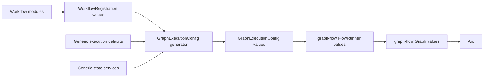

# Jcode runtime ownership and documentation separation plan

Status: implemented in `5976ad9`

The implementation follows this report with `JcodeProcessScope`, ordinary workflow registrations, generic `GraphExecutionConfig` generation, workflow-owned input and trace contracts, and no jcode dependency in `WorkflowService`.

## 1. Decision summary

Treat jcode as one optional, high-level graph-flow node template rather than an application core runtime.
The root application consumes workflow registrations and owns only generic graph-flow execution configuration, history, scheduling, HTTP, and presentation.
The `graph-flow-jcode` crate owns the reusable jcode node mechanism, while the jcode-enabled workflow integration owns the application-specific decision to share one process and how sessions map to workflow runs.

There is no execution branch based on workflow ID, graph definition, topology, or node implementation.
The application generates the same graph-flow runtime configuration and invokes the same runner path for every registration.

The application service must not construct, accept, store, initialize, or report availability of `JcodeRuntime`.
A deployment that never executes a jcode node must not require a jcode binary, GlossShift configuration, credentials, or a running jcode process.

## 2. Problem in the current boundary

The physical `JcodeRuntime` type already lives in `crates/graph-flow-jcode`, but its ownership leaks into the application:

| Current dependency | Why it is the wrong boundary |
| --- | --- |
| `WorkflowService::new` launches jcode eagerly. | Starting the graph-flow console requires an optional node backend. |
| `WorkflowService::build` accepts `Option<&Arc<JcodeRuntime>>`. | The generic workflow service knows a concrete node implementation. |
| `workflows::build_graph` accepts `Option<Arc<JcodeRuntime>>`. | Every graph build path carries an agent-specific parameter. |
| Every run receives `JCODE_SESSION_KEY`. | Non-jcode workflows receive backend-specific context. |
| `without_jcode_runtime` exists for tests. | Tests need a special constructor because the normal constructor has an optional-backend side effect. |
| `WorkflowError::Jcode` is an application startup error. | A jcode launch failure prevents unrelated workflows from running. |
| `StepState` directly contains `JcodeOutput`. | The generic trace model knows one optional node's output schema. |
| The root architecture overview includes jcode process topology. | The documentation presents an optional node template as a core subsystem. |

This shape also makes a future `graph-flow-opencode`, `graph-flow-codex`, or another agent-node crate require another application-wide runtime parameter and another special test constructor.

## 3. Target ownership model



Every workflow follows this single path.
The application does not inspect graph topology, task concrete types, context keys, or captured resources to decide how to build or execute a runtime.
It iterates registrations, generates the same graph-flow execution configuration for each one, and runs the resulting `FlowRunner`.

The boundaries are:

| Layer | Owns | Must not own |
| --- | --- | --- |
| Application core | Run identity, generic graph-flow execution configuration, sessions, limits, history, scheduling, HTTP, UI. | Branching on workflow ID, graph shape, task type, `JcodeRuntime`, or another node backend. |
| Workflow catalog | An ordered collection of type-erased `WorkflowRegistration` values. | Classifying registrations as agent or non-agent workflows. |
| Workflow registration | Its executable graph, definition, input contract, and trace projection. | Application-wide lifecycle or state backend selection. |
| Optional integration bundle | Any resources shared by a related set of workflow registrations and the registrations that capture those resources. | A special execution path in the application core or catalog. |
| Individual jcode workflow | Workflow-to-jcode session mapping, prompts, provider adapter, hooks, and trace projection. | A second process scope when the shared integration policy applies. |
| `graph-flow-jcode` crate | Reusable node, at-most-one process per shared scope, named session registry, SDK option forwarding, hooks, structured output. | A singleton policy for every application or knowledge of workflow-console IDs. |
| jcode SDK | Binary process protocol and high-level client/session operations. | graph-flow routing and workflow history. |

## 4. Process sharing policy

The requirement to use one jcode process is an application integration policy, not an invariant of every `JcodeNode` consumer.

The crate should expose a shareable scope with this local invariant:

> One `JcodeProcessScope` initializes at most one jcode client/process and owns all named sessions created through that scope.

The private jcode integration bundle creates one scope, builds every related workflow registration with clones of that `Arc<JcodeProcessScope>`, and returns ordinary `WorkflowRegistration` values.
The workflow catalog only extends its registration collection with those returned values; it does not branch on their contents or know which resources their graphs capture.
Another application may intentionally create multiple scopes for isolation, different binaries, or different launch environments.

No global static singleton is planned.
A global singleton would make test isolation difficult, prevent multiple intentional launch configurations, and hide ownership.

## 5. Proposed crate API direction

The exact names may be refined during implementation, but the ownership contract is:

```rust
pub struct JcodeProcessScope {
    // Private lazy process and process-local session registry.
}

impl JcodeProcessScope {
    pub fn deferred<F>(factory: F) -> Self
    where
        F: Fn() -> Result<jcode_sdk::JcodeClient, JcodeNodeError>
            + Send
            + Sync
            + 'static;

    pub fn from_client(client: jcode_sdk::JcodeClient) -> Self;
}

pub struct JcodeNode {
    // The node holds Arc<JcodeProcessScope> plus existing factories and hooks.
}
```

The deferred factory is evaluated inside the node's blocking execution boundary.
Concurrent first executions serialize initialization and share the successful process.
A failed initialization leaves the scope uninitialized so a later run may retry after the external problem is corrected.

`JcodeRuntime` may be renamed to `JcodeProcessScope` in one breaking local change because the crate is unpublished.
If the existing name is retained, its documentation must still describe scope ownership and lazy initialization rather than application ownership.

`JcodeNode::run` continues to use `spawn_blocking` for the synchronous SDK.
The scope owns process and session synchronization; graph-flow and the web runtime do not hold SDK locks.

## 6. Lazy launch and failure behavior

Current startup behavior changes as follows:

| Situation | Current behavior | Target behavior |
| --- | --- | --- |
| Server starts and no jcode node runs. | jcode launches before HTTP bind. | No jcode options are loaded and no process starts. |
| jcode binary is missing. | Entire application startup fails. | The first jcode node fails; unrelated workflows remain available. |
| GlossShift adapter is invalid. | Entire application startup fails. | The first affected jcode node fails with a retained step/run error. |
| First jcode node succeeds. | Uses startup-created process. | Lazily creates the integration-owned shared process. |
| Later jcode node runs. | Uses the same process. | Uses the same workflow-integration scope and process. |
| Process launch failed once. | Application exited. | A later node execution may retry initialization. |

The HTTP workflow catalog still lists the jcode workflow because registration is code-defined.
Optional future availability metadata may describe a node integration, but absence of a preflight process must not mark the entire application unavailable.

## 7. Session ownership and reuse

The application core supplies only generic run identity in graph-flow context, for example `workflow_run_id`.
It does not set `jcode_session_key`.

The jcode workflow integration maps generic identity into `SessionMode`:

```text
workflow_run_id
  -> jcode workflow session policy
  -> SessionMode::Reuse(SessionKey)
```

The default policy for one coding task is:

- Nodes in the same workflow run reuse one jcode session.
- Different workflow runs use different jcode sessions.
- A node may explicitly choose `SessionMode::New` when isolation is required.
- A workflow may derive a different stable key when work intentionally spans a larger boundary than one run.

The process scope retains the existing per-session turn mutex so two concurrent nodes cannot interleave turns in one conversation.
Different sessions may use the shared process concurrently subject to SDK guarantees.

The graph-flow `Session` remains application state and is not replaced by a jcode session.
Graph-flow session persistence and jcode conversation persistence are separate concerns.

## 8. Uniform graph-flow execution configuration

`WorkflowService` receives only ordinary registrations and generic application state services.
The registration owns all workflow-specific construction results before it crosses into the service:

```rust
pub struct WorkflowRegistration {
    pub definition: &'static WorkflowDefinition,
    pub graph: Arc<graph_flow::Graph>,
    pub input: Arc<dyn WorkflowInputContract>,
    pub trace_projector: Arc<dyn TraceProjector>,
}

pub fn workflow_registrations() -> Result<Vec<WorkflowRegistration>, WorkflowError>;
```

The application generates the same execution configuration from every registration:

```rust
pub struct GraphExecutionConfig {
    pub definition: &'static WorkflowDefinition,
    pub graph: Arc<graph_flow::Graph>,
    pub session_storage: Arc<dyn graph_flow::SessionStorage>,
    pub limits: WorkflowExecutionLimits,
    pub trace_projector: Arc<dyn TraceProjector>,
}

pub fn generate_execution_config(
    registration: WorkflowRegistration,
    defaults: &WorkflowExecutionDefaults,
    state: &ApplicationState,
) -> Result<GraphExecutionConfig, WorkflowError>;
```

`generate_execution_config` may derive generic limits from `registration.definition.nodes.len()`, apply an explicit workflow override, and attach generic state services.
It must not inspect the graph's tasks or use a workflow-ID match to select a backend-specific constructor.

`WorkflowRuntime` is then created uniformly from `GraphExecutionConfig`, including `FlowRunner::new(config.graph, config.session_storage)`.
The same start and driver path executes every resulting runtime.

Workflow-specific resources are captured before registration:

1. A simple workflow module builds its graph and returns one registration.
2. The jcode integration bundle creates one deferred process scope.
3. The bundle builds one or more workflow graphs whose `JcodeNode` tasks capture that scope.
4. The bundle returns ordinary registrations.
5. The catalog concatenates registration values without classifying them.
6. The application generates and executes identical graph-flow configurations for all registrations.

`WorkflowService` stores no process scope and never imports `graph_flow_jcode::JcodeRuntime`.
The graph's `Arc<dyn Task>` values retain the scope for as long as it is needed.

## 9. Backend-neutral trace state

Removing process injection is the mandatory first step, but `StepState::jcode_output` would still leave a concrete agent backend in the application trace domain.
The separation plan therefore includes a workflow-owned trace projection.

```rust
pub trait TraceProjector: Send + Sync {
    fn project(
        &self,
        context: &graph_flow::Context,
        node_id: &str,
    ) -> Result<serde_json::Value, WorkflowError>;
}

pub struct StepState {
    pub payload: serde_json::Value,
}
```

Each workflow registration supplies its projector:

- Demo workflow projects task tokens and branch decisions.
- Review workflow projects its workflow-owned values.
- jcode translation projects the relevant `JcodeOutput` and translation path.
- A future agent backend projects its own typed output without changing `StepState`.

The application stores and renders the resulting JSON payload but does not know its backend schema.
Projection is the explicit redaction boundary; serializing the complete graph-flow context is not acceptable because it would retain prompts, credentials, or unrelated internal data by accident.

## 10. Error boundary changes

The root `WorkflowError::Jcode` startup variant is removed.

Error routing becomes:

| Failure | Target boundary |
| --- | --- |
| Invalid workflow graph | `WorkflowError::GraphBuild` during registration. |
| Invalid generic application config | application configuration error during startup. |
| jcode launch or SDK failure | `JcodeNodeError`, converted to `GraphError::TaskExecutionFailed`, retained on the exact step and run. |
| jcode hook rejection | same node/run failure path. |
| Trace projection failure | generic workflow trace failure, not a jcode application error. |

`WorkflowService::without_jcode_runtime` is removed.
All service and UI tests use the normal constructor because normal construction has no agent-process side effect.

## 11. Root architecture documentation plan

The root [Workflow console architecture](../architecture.md) should describe graph-flow as the workflow core.
Jcode remains visible only where it is concrete evidence of an optional node integration.

### Remove from the system overview

- jcode from the opening description of the application's core.
- The jcode process, runtime, and session registry from the top-level component diagram.
- jcode launch from the generic application startup sequence.
- `jcode_session_key` and `jcode_output` from the generic context contract.
- jcode-specific startup failures from the general failure model.
- jcode-specific invariants from the application-wide invariant list.

### Keep in narrowly scoped root sections

- `crates/graph-flow-jcode` as one optional workspace integration in the boundary table.
- `jcode-translation` as one registered workflow example.
- A short “Optional node integrations” section explaining that workflows may use high-level node templates.
- The console-specific policy that all jcode-enabled workflow registrations share one private process scope.
- The generic rule that backend-specific process and session ownership must not enter `WorkflowService`.
- A link to the crate architecture document for mechanism details.

The one-process statement belongs in the root document only as a console integration policy, not as the system summary or a universal `JcodeNode` invariant.

## 12. Crate documentation plan

Create:

- `crates/graph-flow-jcode/docs/architecture.md`
- `crates/graph-flow-jcode/docs/architecture.ja.md`

The crate document owns:

1. Crate role and non-goals.
2. `JcodeNode` execution flow.
3. `JcodeProcessScope` lifecycle and at-most-one-process-per-scope invariant.
4. `SessionMode`, named sessions, working-directory compatibility, and turn serialization.
5. Launch, session, prompt, run, and hook configuration surfaces.
6. `JcodeOutput` and the consumer's redaction responsibility.
7. Blocking SDK execution and timeout ownership.
8. Deterministic fake-client tests.
9. The temporary-workspace example and binary lookup.
10. Guidance for consumers choosing one shared scope or multiple isolated scopes.

The crate document must not claim that every application uses exactly one jcode process.
It documents how scope sharing works; the consuming workflow layer chooses the policy.

After the English documents are updated, GlossShift generates the Japanese versions and both are manually checked for heading, table, code identifier, and Mermaid parity.

## 13. Planned file changes

| File | Planned change |
| --- | --- |
| `crates/graph-flow-jcode/src/runtime.rs` | Introduce lazy process scope semantics and keep named sessions inside the scope. |
| `crates/graph-flow-jcode/src/node.rs` | Depend on the shared scope and initialize it only during node execution. |
| `crates/graph-flow-jcode/src/lib.rs` | Export the final scope API and remove the application-oriented context key. |
| `crates/graph-flow-jcode/tests/jcode_node.rs` | Verify zero launch before execution, one launch across shared nodes, retry after failure, and session policies. |
| `crates/graph-flow-jcode/examples/jcode_translation.rs` | Demonstrate scope ownership inside a graph-flow integration. |
| `src/workflows.rs` | Concatenate type-erased registrations without branching on workflow or node type. |
| `src/workflows/jcode_integration.rs` | Own the shared scope and deferred launch factory, then return ordinary registrations whose graphs capture that scope. |
| `src/workflows/jcode_translation.rs` | Consume the private shared integration resource without exposing it to `WorkflowService`. |
| `src/workflows/jcode_translation/definition.rs` | Map generic run identity to jcode session policy. |
| `src/workflow.rs` | Remove jcode launch, runtime injection, special test constructor, and jcode context writes. |
| `src/workflow_trace.rs` | Replace the concrete jcode output field with workflow-owned trace payload. |
| `src/lib.rs` | Remove the jcode-specific application error variant. |
| `docs/architecture.md` | Restore graph-flow-centered application architecture and retain only the narrow integration policy. |
| `docs/architecture.ja.md` | Japanese parity for the root architecture. |
| `crates/graph-flow-jcode/docs/architecture.md` | Detailed reusable node-crate architecture. |
| `crates/graph-flow-jcode/docs/architecture.ja.md` | Japanese parity for the crate architecture. |

## 14. Implementation sequence

1. Add failing crate tests for deferred launch, shared initialization, retry, and named-session behavior.
2. Implement the lazy process scope in `graph-flow-jcode` and update `JcodeNode`.
3. Make the private jcode integration bundle construct one deferred scope and return ordinary registrations that capture it.
4. Introduce one generic `GraphExecutionConfig` generator and use it for every registration.
5. Remove `JcodeRuntime`, `JCODE_SESSION_KEY`, and workflow-type branching from `WorkflowService` and registry execution paths.
6. Replace `without_jcode_runtime` usage with the normal process-free service constructor.
7. Introduce workflow-owned trace projection and remove `JcodeOutput` from application trace state.
8. Remove the jcode-specific application error variant.
9. Run non-jcode workflows with an intentionally invalid `JCODE_BIN` to prove no launch or configuration read occurs.
10. Run the jcode workflow to prove lazy launch, one shared process, and same-run session reuse.
11. Split and revise English architecture documentation, then regenerate and review Japanese parity.
12. Land the application configuration extraction plan after this boundary is established.

## 15. Validation plan

The separation is accepted when all of the following are observable:

- Starting the server with a missing `JCODE_BIN` succeeds.
- Running demo and review workflows with a missing `JCODE_BIN` completes normally.
- Merely rendering or registering the jcode workflow does not load GlossShift configuration or start jcode.
- The first jcode node execution starts exactly one process.
- Two jcode nodes sharing the console integration scope use the same process.
- Two nodes in one workflow run reuse the intended session.
- A node configured for a new session remains isolated.
- A failed first launch is retained as a node/run failure and does not stop the server.
- A later execution can retry launch.
- `WorkflowService`, application config, generic context setup, and root application errors contain no jcode type or key.
- Every registration passes through the same `generate_execution_config` and `FlowRunner` construction path.
- Runtime construction contains no match or conditional on workflow ID, graph topology, or concrete task type.
- `StepState` contains no jcode-specific field.
- Root architecture diagrams and system summary remain valid when the jcode workflow is removed.
- Crate documentation fully describes the optional integration mechanism.
- Formatting, Clippy, workspace tests, the isolated example, and live HTTP/browser smoke checks pass.

## 16. Non-goals

- Making jcode the application-wide agent abstraction.
- Defining one universal agent runtime trait before a second concrete backend exists.
- Starting one jcode process per node or per run.
- A global static jcode singleton.
- Persisting or reattaching jcode sessions across application restarts.
- Testing MCP or skill discovery that belongs to jcode SDK behavior.
- Adding jcode fields to `ApplicationConfig`.
- Hiding workflow-specific prompts, credentials, or provider adapters inside the generic node crate.
