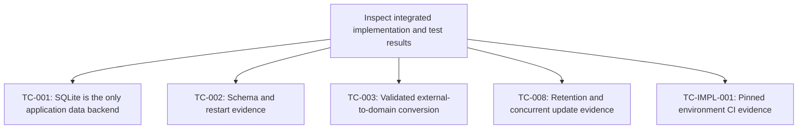
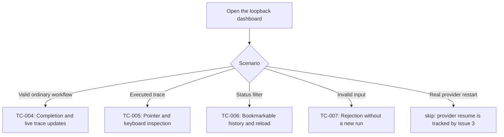

# QA Flow: SQLite storage migration

- **Identifier:** sqlite-storage
- **Author:** Jcode
- **Source:** [QA design](./qa-design.md)
- **Created at:** 2026-09-05
- **Status:** draft

## Overview

The acceptance review combines actual SQLite test evidence with a live browser workflow.
The browser actor is Jcode's built-in browser tool, not a separate browser automation integration.

## Storage and boundary review

Success criteria covered by this section: SC-1, SC-2, SC-3, SC-5.

## Live browser acceptance

Success criteria covered by this section: SC-4.

## Browser procedure

1. Start the application through the pinned development environment and canonical `just run` command.
2. Open a dedicated browser tab at `http://127.0.0.1:3000/` without disturbing unrelated tabs.
3. For TC-004, use a unique run label and an allowed step delay, submit the form, and observe the same run transition to completed without manually reloading the page.
4. For TC-005, select an executed node or step, inspect its details, then use keyboard activation on a focusable trace control.
5. For TC-006, select a status filter, verify the URL and matching history, and reload that URL.
6. For TC-007, submit a whitespace-only label that passes the HTML `required` check but fails the server's semantic validator, then verify the error and absence of a run with that label.
7. Record observed outcomes and limitations in the QA design's execution-evidence section.
8. Stop the application process started for QA when the checks finish.
